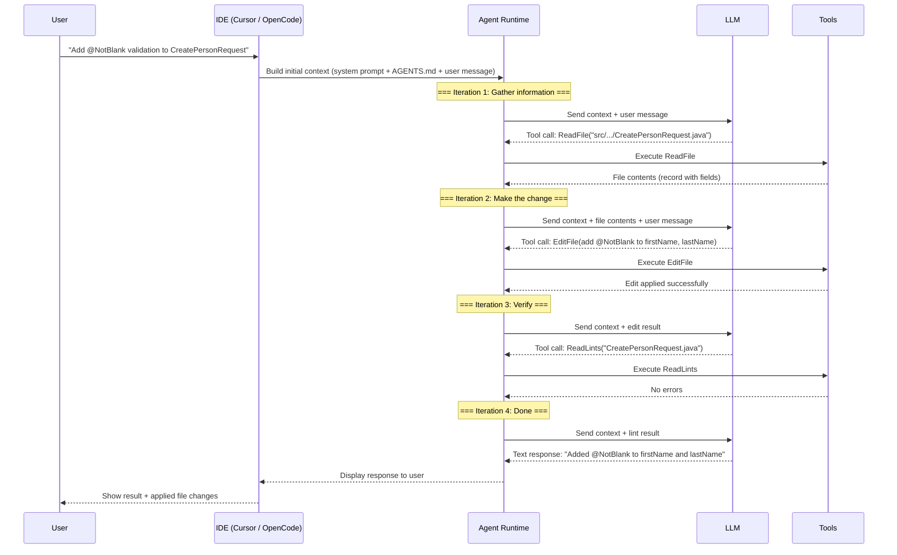
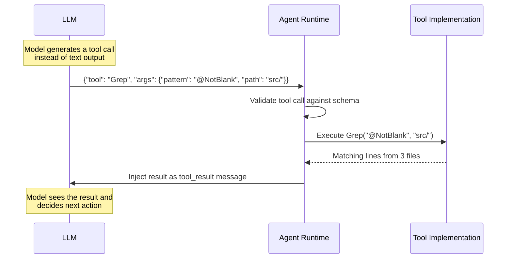
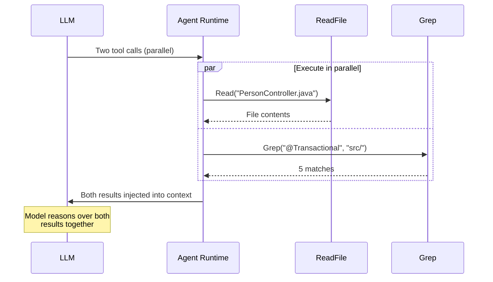
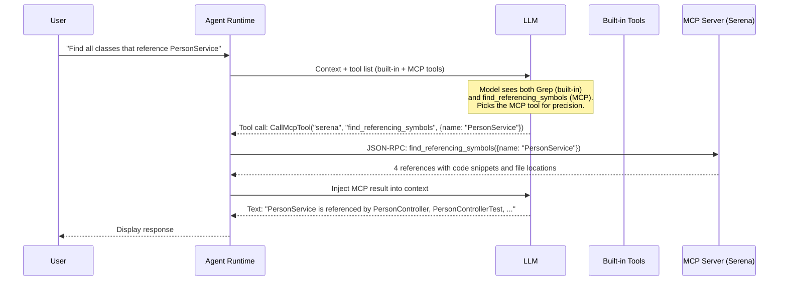
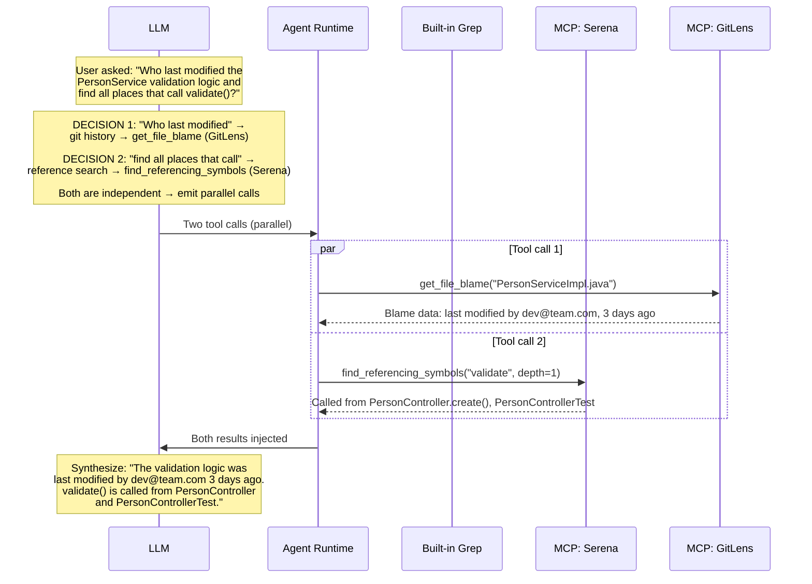
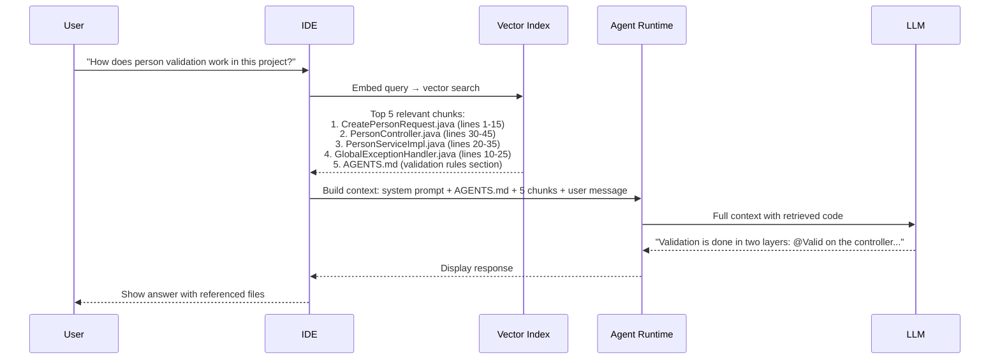
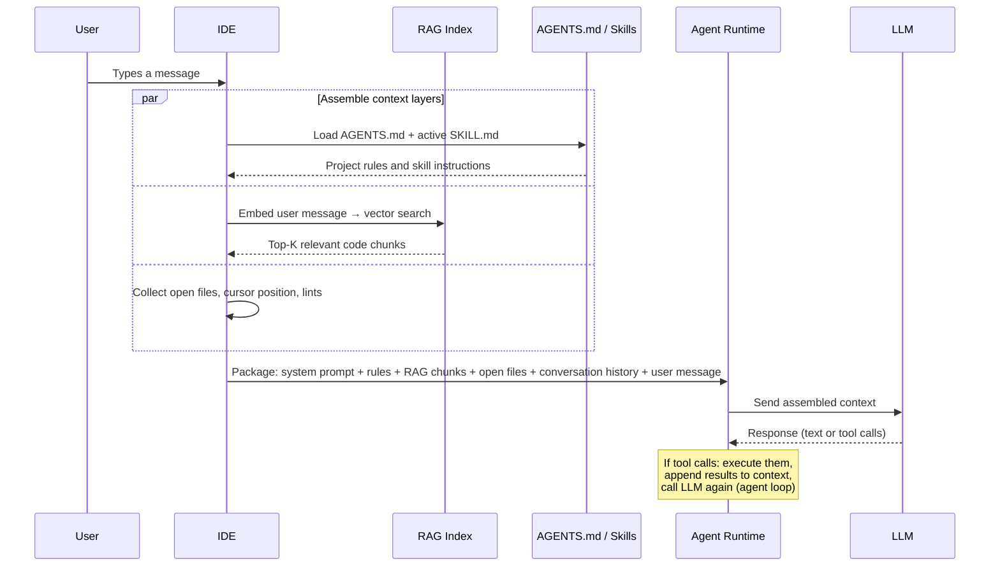
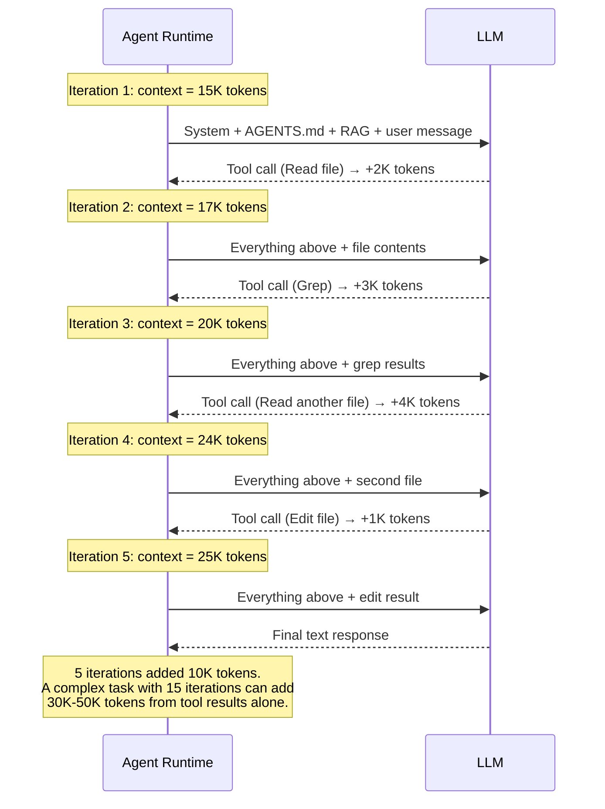
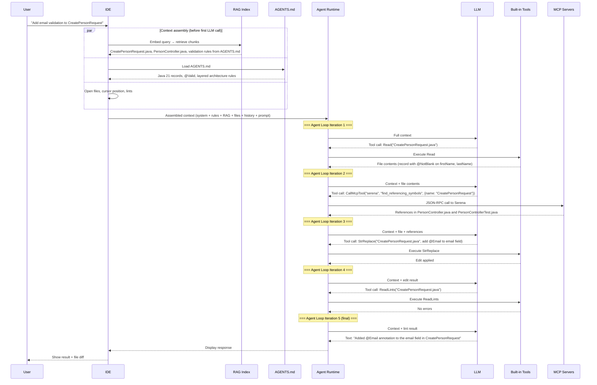

# Section 2: How AI Assistants Actually Work

Section 1 taught you the setup basics.
This section looks under the hood and explains **how they work** -- the
runtime architecture that turns your natural-language prompt into code
changes, file edits, and shell commands.

Understanding these internals lets you:
- Debug situations where the assistant misreads your project
- Write better AGENTS.md and SKILL.md files by knowing how they are consumed
- Choose the right tool (MCP, RAG, direct file read) for each situation
- Reason about context window limits instead of guessing

---

## 1. The Agent Loop

Every AI coding assistant -- Cursor, OpenCode, SourceCraft, GitHub Copilot
Chat -- runs the same fundamental loop at its core. This loop is what makes
an assistant an **agent** rather than a simple chatbot.

### The Perception-Reasoning-Action Cycle

A basic chatbot does one thing: receive a message, produce a response. An
agent does something fundamentally different -- it **acts on the world** and
**observes the result** in a continuous loop until the task is done.

```text
┌──────────────────────────────────────────────────────────┐
│                     The Agent Loop                        │
│                                                          │
│   ┌──────────┐                                           │
│   │  Perceive │◄──────────────────────────────┐          │
│   │  (observe │                               │          │
│   │  results) │                               │          │
│   └────┬──────┘                               │          │
│        │                                      │          │
│        ▼                                      │          │
│   ┌──────────┐                           ┌────┴──────┐   │
│   │  Reason   │                           │  Observe   │   │
│   │  (LLM     │                           │  (read     │   │
│   │  decides) │                           │  result)   │   │
│   └────┬──────┘                           └────▲──────┘   │
│        │                                      │          │
│        ▼                                      │          │
│   ┌──────────┐        ┌───────────┐     ┌────┴──────┐   │
│   │  Decide   │───────►│  Execute  │────►│  Tool     │   │
│   │  (pick    │        │  tool call│     │  returns  │   │
│   │  action)  │        └───────────┘     │  output   │   │
│   └──────────┘                           └───────────┘   │
│                                                          │
│   Loop continues until: task is complete, or the model   │
│   decides no more actions are needed.                    │
└──────────────────────────────────────────────────────────┘
```

### Step-by-Step: How a Single Request Flows

When you type "Add `@NotBlank` validation to `CreatePersonRequest`" in your
IDE, here is exactly what happens:



Key observations:

1. **The LLM does not edit files directly.** It produces structured tool calls
   that the agent runtime executes. The LLM never touches your filesystem.

2. **Each iteration adds to the context.** The agent appends each tool result
   to the conversation history before calling the LLM again.

3. **The LLM decides when to stop.** When it produces a text response instead
   of a tool call, the loop ends.

4. **The loop is stateless between iterations at the model level.** The entire
   conversation (system prompt + all prior messages + all tool results) is
   re-sent to the LLM on every iteration. The LLM has no memory between
   calls -- only the ever-growing context window.

### What Makes an Agent Different from a Chatbot

| Aspect            | Chatbot                       | Agent                              |
|-------------------|-------------------------------|------------------------------------|
| Interaction       | One prompt → one response     | One prompt → N iterations          |
| Side effects      | None (text only)              | Reads files, writes code, runs commands |
| Observation       | None                          | Reads tool results, adapts         |
| Termination       | After first response          | When the model decides task is done |
| Context growth    | Fixed                         | Grows with each tool result        |

### Why This Matters for You

Understanding the agent loop explains several things you have already
experienced:

- **Why the assistant sometimes reads files you did not ask about**: it is
  gathering context in an early iteration before making changes.
- **Why long tasks can degrade in quality**: after many iterations the context
  window fills up and older information falls out of the model's attention.
- **Why "think step by step" works**: it forces the model to spend one or
  more iterations on reasoning before it starts writing code
  (see [Section 4](04-prompt-techniques.md)).

---

## 2. Tools -- How the LLM Acts on the World

The agent loop runs on **tools**. Without tools, the LLM can only produce
text. With tools, it can read files, edit code, run tests, search the
codebase, and interact with external systems.

### What Is a Tool?

A tool is a function exposed to the LLM via a JSON schema. The schema tells
the model: "here is a capability you can invoke, here are its parameters,
here is what it returns."

The LLM never executes the tool. It produces a **structured tool call** (a
JSON object), and the agent runtime executes it.

Example -- a simplified `ReadFile` tool schema:

```json
{
  "name": "ReadFile",
  "description": "Read the contents of a file at the given path",
  "parameters": {
    "type": "object",
    "properties": {
      "path": {
        "type": "string",
        "description": "Absolute path to the file"
      },
      "offset": {
        "type": "integer",
        "description": "Line number to start reading from (optional)"
      },
      "limit": {
        "type": "integer",
        "description": "Number of lines to read (optional)"
      }
    },
    "required": ["path"]
  }
}
```

When the LLM decides it needs to read a file, it does **not** output
"let me read the file." It outputs a structured JSON call:

```json
{
  "tool": "ReadFile",
  "arguments": {
    "path": "/home/dev/project/src/main/java/com/example/demo/dto/CreatePersonRequest.java"
  }
}
```

The agent runtime intercepts this, executes the file read, and injects
the result back into the conversation as a tool result message.

### Tool Execution Sequence



### Built-In Tools in AI Assistants

Each assistant ships with a fixed set of built-in tools. The model cannot
use tools that are not registered. Here is what Cursor provides:

| Tool          | Purpose                                    | Side Effects |
|---------------|--------------------------------------------|--------------|
| Read          | Read file contents                         | None         |
| Grep          | Search file contents with regex            | None         |
| Glob          | Find files by name pattern                 | None         |
| SemanticSearch| Find code by meaning (vector search)       | None         |
| StrReplace    | Replace exact string in a file             | Writes file  |
| Write         | Create or overwrite a file                 | Writes file  |
| Shell         | Execute a shell command                    | Arbitrary    |
| ReadLints     | Read linter/compiler diagnostics           | None         |
| Task          | Launch a subagent (see [Section 11](11-agents-subagents.md)) | Spawns agent |
| CallMcpTool   | Call an MCP server tool (see section 3)    | Varies       |

OpenCode and SourceCraft have equivalent tools with different names but
the same fundamental categories: **read**, **search**, **edit**, **execute**,
and **delegate**.

### How the Model Chooses Which Tool to Call

The LLM does not follow a decision tree or a routing table. Tool selection
is a **learned behavior** that emerges from three inputs the model evaluates
on every iteration of the agent loop:

1. **Tool descriptions** -- the `description` field in every tool schema
2. **The current task** -- what the user asked for, plus what was learned
   in prior iterations
3. **Training** -- RLHF and tool-use fine-tuning that teach the model
   when each tool type is appropriate

Here is how the model reasons (simplified):

```text
┌──────────────────────────────────────────────────────────────────┐
│               Tool Selection Decision Process                    │
│                                                                  │
│  Input: User intent + all tool schemas in system prompt          │
│                                                                  │
│  Step 1: UNDERSTAND THE NEED                                     │
│     What information or action does the current step require?    │
│     → "I need to know which files reference PersonService"       │
│                                                                  │
│  Step 2: MATCH AGAINST TOOL DESCRIPTIONS                         │
│     Scan all available tool descriptions for semantic match:     │
│     ┌──────────────────────────────────────────────────────┐     │
│     │ Grep: "Search file contents with regex"              │     │
│     │ SemanticSearch: "Find code by meaning"               │     │
│     │ find_referencing_symbols: "Find all symbols that     │     │
│     │   reference the given symbol, with context"          │     │
│     │ git_log: "Get commit history for a file"             │     │
│     │ run_query: "Execute a SQL query"                     │     │
│     └──────────────────────────────────────────────────────┘     │
│                                                                  │
│  Step 3: RANK BY RELEVANCE                                       │
│     Grep → can find text "PersonService" but misses indirect     │
│            references (via variable types, subclasses)           │
│     find_referencing_symbols → designed exactly for this task,   │
│            returns structured reference data with context        │
│                                                                  │
│  Step 4: SELECT AND CALL                                         │
│     → find_referencing_symbols wins (highest relevance)          │
│                                                                  │
│  The model can also pick MULTIPLE tools in parallel              │
│  if the tasks are independent (see Parallel Tool Calls below).   │
└──────────────────────────────────────────────────────────────────┘
```

Common patterns the model has learned:

| User Intent                            | Likely Tool Choice    | Why                                |
|----------------------------------------|-----------------------|------------------------------------|
| "Find where X is used"                 | Grep or MCP find_refs | Text match vs semantic match       |
| "Read this file"                       | Read                  | Direct file access                 |
| "Change this code"                     | StrReplace or Write   | Modify existing vs create new      |
| "Run the tests"                        | Shell                 | Command execution                  |
| "Search the codebase for concepts"     | SemanticSearch        | Meaning-based retrieval            |
| "Interact with an external system"     | CallMcpTool           | Only MCP can reach external systems|

The critical insight: **tool descriptions are the primary routing mechanism**.
The model matches the semantics of what it needs against the `description`
field of every available tool. This is why well-written MCP tool descriptions
are essential -- a poorly described tool will never be selected, even if it
is the perfect tool for the job. More on this in section 3.

### Parallel Tool Calls

Modern assistants support **parallel tool execution**. When the model
determines that two tool calls are independent, it can emit both in a
single response and the runtime executes them simultaneously:



This is why you sometimes see the assistant reading multiple files
at once -- it is a deliberate optimization to reduce the number of
loop iterations.

---

## 3. MCP -- Model Context Protocol

MCP is an open standard (created by Anthropic, adopted across the
industry) that lets you connect **external capabilities** to your AI
assistant without modifying the assistant itself.

### The Problem MCP Solves

Built-in tools are fixed by the IDE vendor. If you need the assistant to:
- Query your GitLab merge requests
- Read symbols from a language server
- Look up rows in a production database
- Fetch a Jira ticket description

...you cannot add those as built-in tools. MCP provides a **standard
protocol** for plugging in external tool servers.

### Architecture

MCP defines three roles:

```text
┌─────────────────────────────────────────────────────────────┐
│                        MCP Host                              │
│                  (IDE: Cursor, OpenCode)                     │
│                                                             │
│  ┌───────────────────────────────────────────────────────┐   │
│  │                     MCP Client                        │   │
│  │              (AI Assistant / Agent)                   │   │
│  │                                                       │   │
│  │  Sees MCP tools in its tool list alongside            │   │
│  │  built-in tools (Read, Grep, Shell, etc.)             │   │
│  └──────┬────────────────┬──────────────┬────────────────┘   │
│         │                │              │                    │
│         ▼                ▼              ▼                    │
│  ┌────────────┐  ┌────────────┐  ┌───────────────┐          │
│  │ MCP Server │  │ MCP Server │  │ MCP Server    │          │
│  │ (GitLens)  │  │ (Serena)   │  │ (Database)    │          │
│  │            │  │            │  │               │          │
│  │ Tools:     │  │ Tools:     │  │ Tools:        │          │
│  │ - git_log  │  │ - find_sym │  │ - run_query   │          │
│  │ - blame    │  │ - get_refs │  │ - list_tables │          │
│  │ - diff     │  │ - search   │  │ - describe    │          │
│  └────────────┘  └────────────┘  └───────────────┘          │
└─────────────────────────────────────────────────────────────┘
```

- **MCP Host**: The IDE application that runs the assistant.
- **MCP Client**: The agent inside the IDE that communicates with MCP servers.
- **MCP Server**: A separate process (local or remote) that exposes tools,
  resources, and prompts via the MCP protocol (JSON-RPC over stdio or SSE).

### How MCP Integrates with the Agent Loop

MCP tools appear in the model's tool list **exactly like built-in tools**.
The model does not know or care whether a tool is built-in or comes from
an MCP server. It simply picks the best tool for the job.



### When Does MCP Get Called vs Built-In Tools?

The model chooses based on the tool description in the schema. The decision
is not hardcoded -- it emerges from the LLM's training and the tool
descriptions you provide.

| Scenario                                      | Likely Tool Choice         | Why                                     |
|-----------------------------------------------|----------------------------|-----------------------------------------|
| Read a known file path                        | Built-in Read              | Direct, no overhead                     |
| Search for a text pattern                     | Built-in Grep              | Fast regex search                       |
| Find all references to a symbol               | MCP (Serena)               | Semantic understanding, not just text   |
| Get git blame for a file                      | MCP (GitLens)              | Git-specific operation                  |
| Run a database query                          | MCP (Database)             | External system access                  |
| List files matching a pattern                 | Built-in Glob              | Filesystem operation                    |
| Find code by meaning ("where is auth done?")  | Built-in SemanticSearch    | Vector index is built-in                |

### MCP Resources vs Tools

MCP servers can also expose **resources** -- read-only data that the
assistant can fetch without executing a function. Resources have URIs
and are useful for static context like documentation, configuration
schemas, or API specifications.

| MCP Capability | Purpose                          | Example                                |
|----------------|----------------------------------|----------------------------------------|
| Tools          | Actions the model can invoke     | `find_symbol`, `run_query`, `git_log`  |
| Resources      | Read-only data for context       | Project README, API schema, DB schema  |
| Prompts        | Reusable prompt templates        | Code review template, migration guide  |

### Configuring MCP in Your Project

MCP servers are registered in your IDE settings. In Cursor, this is
typically in `.cursor/mcp.json` or the global settings:

```json
{
  "mcpServers": {
    "serena": {
      "command": "uvx",
      "args": ["serena-mcp", "--project-root", "."],
      "description": "Semantic code analysis"
    },
    "database": {
      "command": "npx",
      "args": ["-y", "@modelcontextprotocol/server-postgres", "postgresql://localhost:5432/mydb"],
      "description": "PostgreSQL database access"
    }
  }
}
```

Once registered, the MCP server's tools appear in the model's tool list
automatically. No prompt changes are needed.

### Tool Resolution with Multiple MCP Servers

When you connect several MCP servers, the model's tool list can grow to
dozens or even hundreds of tools. A typical setup might look like this:

```text
Tool list seen by the LLM (in system prompt):
┌─────────────────────────────────────────────────────────────────┐
│  Built-in tools (10):                                           │
│    Read, Grep, Glob, SemanticSearch, StrReplace, Write,         │
│    Shell, ReadLints, Task, CallMcpTool                          │
│                                                                 │
│  MCP: GitLens (5 tools):                                        │
│    get_file_blame, get_file_changes, get_commit_details,        │
│    get_working_changes, search_commits                          │
│                                                                 │
│  MCP: Serena (8 tools):                                         │
│    find_symbol, get_symbols_overview, find_referencing_symbols,  │
│    replace_symbol_body, insert_before_symbol,                   │
│    insert_after_symbol, search_for_pattern, list_dir            │
│                                                                 │
│  MCP: Database (4 tools):                                       │
│    run_query, list_tables, describe_table, get_schema           │
│                                                                 │
│  Total: 27 tools                                                │
└─────────────────────────────────────────────────────────────────┘
```

The model must pick the right tool from all 27 on every iteration.
Here is how it works:

#### The Decision Is Description-Driven, Not Server-Driven

The model does **not** think "I should use the Serena MCP server."
It thinks "I need to find all references to PersonService" and then
scans all 27 tool descriptions for the best match. The fact that
`find_referencing_symbols` comes from Serena is irrelevant to the
model -- it only cares about the tool's description and parameters.

This means **tool description quality is the primary factor** in
whether an MCP tool gets selected:

| Description Quality                                    | Will the model pick it?           |
|--------------------------------------------------------|-----------------------------------|
| `"find_referencing_symbols: Find all symbols that reference the given symbol, including call sites, imports, and type references. Returns code snippets and file locations."` | Yes -- clear, specific, matches many intents |
| `"find_refs: Find refs"` | Rarely -- too vague, the model cannot tell what it does |
| `"tool_7: Execute operation type 3 on the codebase"` | Never -- incomprehensible description |

#### How the Model Resolves Overlapping Tools

Multiple tools can serve similar purposes. When the model sees
overlapping capabilities, it uses several heuristics to choose:



The model chose GitLens for git history and Serena for code references
because each tool's description matched the specific sub-task. Built-in
Grep was **not** chosen even though it could find the text "validate"
because the model recognized that semantic reference search is more
precise than text matching for this request.

#### Resolution Heuristics

When multiple tools could handle the same intent, the model applies
these implicit priorities:

| Heuristic                          | Example                                    | Effect                                    |
|------------------------------------|--------------------------------------------|-------------------------------------------|
| **Specificity wins**               | `find_referencing_symbols` vs `Grep`       | Specialized tool beats general-purpose     |
| **Description match**              | "find symbol" matches `find_symbol` over `search_for_pattern` | Closer semantic match wins |
| **Minimize round-trips**           | One tool returning structured data vs two tools returning raw text | Fewer iterations preferred |
| **Prefer read-only first**         | `get_symbols_overview` before `replace_symbol_body` | Gather context before acting |
| **Built-in for simple tasks**      | `Read` for reading a known file path       | No MCP overhead for basic operations      |
| **MCP for domain-specific tasks**  | `run_query` for database operations        | Only MCP can reach external systems       |

#### When Tool Selection Goes Wrong

The model can make suboptimal tool choices. Common failure modes:

**Problem: Vague tool descriptions**

If two MCP tools have similar vague descriptions, the model may pick the
wrong one or hesitate between them. Fix this by writing precise, distinct
descriptions for each tool.

**Problem: Too many tools**

With 50+ tools, the tool schemas alone consume 5K-10K tokens of the context
window, and the model has more options to get confused by. Each MCP server
you add increases system prompt size and selection complexity.

**Problem: Missing tool**

If no tool matches the intent, the model will improvise -- often by using
Shell to run a command, or by using Grep as a fallback for any search task.
This produces lower-quality results than a purpose-built tool.

**Mitigation strategies:**

1. **Write descriptive tool descriptions** when building MCP servers.
   Include the use case, not just the function signature.
2. **Limit connected MCP servers** to those you actually use. Disconnect
   servers you are not actively working with.
3. **Use AGENTS.md to guide tool preference** -- you can add instructions
   like "For code reference searches, prefer the Serena MCP tools over
   built-in Grep when available."

#### Guiding Tool Selection via AGENTS.md

You can influence the model's tool selection by adding hints in AGENTS.md.
Because AGENTS.md sits early in the context window (section 5), these
hints are seen on every iteration:

```markdown
## Tool Usage Preferences

- For finding symbol references and call sites, use Serena's
  `find_referencing_symbols` tool instead of Grep
- For git blame and commit history, use GitLens MCP tools
- For database schema questions, use the Database MCP `describe_table`
  tool before writing SQL queries
- Use built-in Grep only for literal text pattern matching
```

This is not a hard rule -- the model can still choose differently if
the context suggests it -- but it provides a strong default preference
that resolves ambiguity in most cases.

---

## 4. RAG -- Retrieval-Augmented Generation

RAG is the mechanism that lets the assistant answer questions about your
codebase without reading every file into the context window.

### The Problem RAG Solves

An LLM's context window is finite (typically 128K-200K tokens). A
medium-sized Java project has millions of tokens of source code. The
model cannot see everything at once.

Without RAG, the model must rely on:
1. Files you explicitly open in your IDE
2. Files it reads one-by-one via tool calls (slow, wastes iterations)
3. Its training data (outdated, not project-specific)

RAG bridges this gap by **pre-indexing** your codebase and retrieving
only the relevant fragments when needed.

### The RAG Pipeline: Embed → Retrieve → Inject

```text
┌──────────────────────────────────────────────────────────────────┐
│                      RAG Pipeline                                │
│                                                                  │
│  1. INDEX (offline, runs when you open the project)              │
│     ┌──────────┐     ┌──────────┐     ┌──────────────────┐      │
│     │ Source    │────►│ Chunker  │────►│ Embedding Model  │      │
│     │ Files    │     │ (split   │     │ (text → vector)  │      │
│     │          │     │  into    │     │                  │      │
│     │ .java    │     │  chunks) │     │ [0.12, -0.03,    │      │
│     │ .xml     │     │          │     │  0.87, ...]      │      │
│     │ .yaml    │     └──────────┘     └──────┬───────────┘      │
│     └──────────┘                             │                  │
│                                              ▼                  │
│                                     ┌──────────────────┐        │
│                                     │ Vector Database   │        │
│                                     │ (local index)     │        │
│                                     └──────────────────┘        │
│                                                                  │
│  2. RETRIEVE (at query time)                                     │
│     ┌──────────────┐     ┌──────────────┐     ┌─────────────┐   │
│     │ User query   │────►│ Embed query  │────►│ Nearest     │   │
│     │ "How does    │     │ (same model) │     │ neighbor    │   │
│     │  person      │     │              │     │ search      │   │
│     │  validation  │     └──────────────┘     └──────┬──────┘   │
│     │  work?"      │                                 │          │
│     └──────────────┘                                 ▼          │
│                                              Top-K chunks       │
│                                                                  │
│  3. INJECT (into prompt)                                         │
│     ┌──────────────────────────────────────────────────────┐     │
│     │ System prompt + AGENTS.md + retrieved chunks +       │     │
│     │ conversation history + user message                  │     │
│     │                                    ──► LLM ──► answer│     │
│     └──────────────────────────────────────────────────────┘     │
└──────────────────────────────────────────────────────────────────┘
```

### Step-by-Step: RAG in Action



### RAG vs Direct File Read vs MCP

These three mechanisms all serve the same goal -- getting relevant
information into the LLM's context -- but they work differently:

| Mechanism     | When It Runs                  | Who Decides What to Fetch     | Latency   | Precision       |
|---------------|-------------------------------|-------------------------------|-----------|-----------------|
| RAG           | Automatically at query time   | Vector similarity             | Low       | Approximate     |
| Direct Read   | When model calls Read tool    | The model (explicit decision) | Medium    | Exact           |
| MCP           | When model calls MCP tool     | The model (explicit decision) | Medium    | Exact + semantic|

In practice, all three work together in a single request:

1. **RAG** retrieves initial context before the first LLM call
2. **The model** reads additional files via **Read** tool calls
3. **The model** queries MCP servers for semantic information (references,
   symbol types) that neither RAG nor file reads provide

### How Indexing Works in Practice

When you open a project in Cursor or OpenCode, the IDE:

1. **Scans** all non-ignored files (respects `.gitignore`)
2. **Chunks** each file into segments (~100-500 tokens each)
3. **Embeds** each chunk using a small, fast embedding model
4. **Stores** the vectors in a local database

This index is updated incrementally as you edit files. The index is
what powers the `SemanticSearch` tool and the automatic context
retrieval that happens before each LLM call.

### RAG Quality Depends on Your Code

RAG retrieval quality is directly affected by:

- **Naming**: Well-named classes and methods produce better embeddings.
  `PersonValidationService` retrieves better than `Utils2`.
- **Comments**: Javadoc and meaningful comments improve chunk relevance.
- **File organization**: Small, focused files produce better chunks than
  4000-line God classes.
- **AGENTS.md**: Often retrieved as a top chunk because it contains
  dense, project-specific terminology.

---

## 5. Context Engineering

Context engineering is the discipline of controlling **what information
the LLM sees** when it processes your request. It is the most
high-leverage skill in AI-assisted development because the same model
produces dramatically different results depending on what is in its
context window.

### The Context Window Anatomy

When the agent runtime calls the LLM, it assembles a context from
multiple sources. Here is the full stack, in the order it is typically
assembled:

```text
┌──────────────────────────────────────────────────────────────────┐
│                    LLM Context Window (~200K tokens)              │
│                                                                  │
│  ┌────────────────────────────────────────────────────────────┐   │
│  │  1. System Prompt (IDE-injected)                     ~5K  │   │
│  │     - Model persona and safety rules                      │   │
│  │     - Tool schemas (built-in + MCP)                       │   │
│  │     - IDE-specific instructions                           │   │
│  └────────────────────────────────────────────────────────────┘   │
│  ┌────────────────────────────────────────────────────────────┐   │
│  │  2. AGENTS.md / Rules (project-level)                ~2K  │   │
│  │     - Architecture rules, naming conventions              │   │
│  │     - Technology stack description                        │   │
│  │     - Team guidelines                                     │   │
│  └────────────────────────────────────────────────────────────┘   │
│  ┌────────────────────────────────────────────────────────────┐   │
│  │  3. SKILL.md (if activated)                          ~1K  │   │
│  │     - Skill-specific instructions and examples            │   │
│  └────────────────────────────────────────────────────────────┘   │
│  ┌────────────────────────────────────────────────────────────┐   │
│  │  4. RAG-Retrieved Chunks (automatic)                 ~5K  │   │
│  │     - Code fragments relevant to the query                │   │
│  │     - Selected by vector similarity                       │   │
│  └────────────────────────────────────────────────────────────┘   │
│  ┌────────────────────────────────────────────────────────────┐   │
│  │  5. Open Files / Cursor Position                     ~3K  │   │
│  │     - Currently visible file(s) in the editor             │   │
│  │     - Cursor location for inline suggestions              │   │
│  └────────────────────────────────────────────────────────────┘   │
│  ┌────────────────────────────────────────────────────────────┐   │
│  │  6. Conversation History                         variable  │   │
│  │     - All prior messages in this chat session             │   │
│  │     - All prior tool calls and results                    │   │
│  └────────────────────────────────────────────────────────────┘   │
│  ┌────────────────────────────────────────────────────────────┐   │
│  │  7. Tool Results (accumulated during agent loop)  variable │   │
│  │     - File contents from Read calls                       │   │
│  │     - Search results from Grep / SemanticSearch           │   │
│  │     - MCP tool outputs                                    │   │
│  │     - Shell command outputs                               │   │
│  └────────────────────────────────────────────────────────────┘   │
│  ┌────────────────────────────────────────────────────────────┐   │
│  │  8. User Message (your prompt)                       ~0.5K│   │
│  │     - The actual question or instruction                  │   │
│  └────────────────────────────────────────────────────────────┘   │
└──────────────────────────────────────────────────────────────────┘
```

### Context Assembly Sequence



### The Context Budget

A 200K token context window sounds large, but it fills up fast:

| Source                     | Typical Size   | Notes                              |
|----------------------------|----------------|------------------------------------|
| System prompt + tool schemas | 3K-8K tokens | Grows with each MCP server added   |
| AGENTS.md                  | 500-2K tokens  | You control this                   |
| RAG chunks (5 chunks)      | 2K-5K tokens   | Automatic                          |
| Open files (2 files)       | 1K-4K tokens   | What you have open in editor       |
| Conversation history       | 0-100K tokens  | Grows with every exchange          |
| Tool results (per iteration)| 0.5K-10K tokens| Each file read, grep, etc.         |
| **Your message**           | 50-500 tokens  | Your actual prompt                 |

After 10-15 back-and-forth exchanges with multiple file reads, the
conversation history alone can consume 50K-100K tokens. This is why
long conversations degrade in quality -- a phenomenon called **context
rot**.

### Context Rot: How Increasing Input Tokens Degrades Performance

"Context rot" is the progressive degradation of LLM output quality as
the context window fills up. Even though modern models accept 128K-200K
tokens, their ability to **use** that context effectively is not uniform
across the window. Understanding this effect is critical for anyone
who relies on long agent sessions.

#### The Mechanism: Attention Dilution

Transformer-based LLMs process all input tokens through self-attention
layers. Each token "attends" to every other token, but attention is
a finite resource. As input length grows:

1. **Attention per token decreases.** With 5K tokens, each token
   receives 1/5000th of the attention budget. With 100K tokens, it
   receives 1/100000th -- a 20x reduction.

2. **Critical instructions get diluted.** Your AGENTS.md rules, the
   user's intent, and the most recent tool result compete for attention
   with thousands of tokens of old conversation history and stale file
   contents.

3. **The model "forgets" earlier context.** Not literally (all tokens
   are still present), but practically -- the model's ability to recall
   and act on information from early in the context window decreases
   as the window grows.

```text
┌────────────────────────────────────────────────────────────────────┐
│           Attention Quality vs Context Length                       │
│                                                                    │
│  Quality                                                           │
│  ▲                                                                 │
│  │ ████                                                            │
│  │ █████████                                                       │
│  │ █████████████                                                   │
│  │ ██████████████████                                              │
│  │ ████████████████████████                                        │
│  │ █████████████████████████████████                               │
│  │ ████████████████████████████████████████████                    │
│  │ ██████████████████████████████████████████████████████████████  │
│  └─────────────────────────────────────────────────────────────►   │
│   5K    20K    50K     80K    100K    128K    160K    200K tokens   │
│                                                                    │
│  Sweet spot: 5K-30K tokens                                         │
│  Diminishing returns: 30K-80K tokens                               │
│  Significant degradation: 80K+ tokens                              │
└────────────────────────────────────────────────────────────────────┘
```

#### The "Lost in the Middle" Problem

Research (Liu et al., 2023) demonstrated that LLMs have a **U-shaped
attention curve**: they pay most attention to tokens at the **beginning**
and **end** of the context window, and least attention to tokens in the
**middle**.

```text
┌────────────────────────────────────────────────────────────────────┐
│                   Attention Distribution                            │
│                                                                    │
│  Attention                                                         │
│  ▲                                                                 │
│  │ ████                                              ████████████ │
│  │ ██████                                          ██████████████ │
│  │ ████████                                      ████████████████ │
│  │ ██████████                                  ██████████████████ │
│  │ ████████████                              ████████████████████ │
│  │ ████████████████                    ██████████████████████████ │
│  │ ██████████████████████████████████████████████████████████████ │
│  └─────────────────────────────────────────────────────────────►   │
│   Beginning          Middle                          End           │
│   (system prompt,    (old conversation,       (recent tool results,│
│    AGENTS.md)         stale file reads)        user message)       │
│                                                                    │
│   HIGH attention     LOW attention             HIGH attention      │
└────────────────────────────────────────────────────────────────────┘
```

This has direct implications for how AI assistants behave:

| Position in Context              | What Lives Here             | Attention Level | Implication                                     |
|----------------------------------|-----------------------------|-----------------|-------------------------------------------------|
| Beginning (first ~10K tokens)    | System prompt, AGENTS.md    | High            | Rules defined here are reliably followed         |
| Middle (10K-150K tokens)         | Old messages, stale reads   | Low             | Earlier instructions may be "forgotten"          |
| End (last ~5K tokens)            | Latest tool result, prompt  | High            | Your current message gets strong attention        |

#### How Context Rot Manifests in Practice

You have likely experienced these symptoms without knowing the cause:

**Symptom 1: The model "forgets" your architecture rules**

After 15+ messages, the model starts generating code that violates
your AGENTS.md conventions -- returning entities instead of DTOs,
putting logic in controllers, using wrong naming patterns. The
AGENTS.md rules are still in the context (at the beginning), but 100K
tokens of conversation history have pushed them into the low-attention
zone.

**Symptom 2: The model contradicts its own earlier analysis**

In message 5, the model correctly identified that `PersonService`
uses `@Transactional`. In message 20, it generates code that duplicates
the transaction boundary. The earlier analysis has rotted -- the model
can no longer effectively retrieve it from the bloated context.

**Symptom 3: Repetitive tool calls**

The model re-reads files it already read 10 messages ago. The earlier
read result is still in the context, but the model cannot effectively
attend to it through the noise of intervening messages, so it reads
the file again.

**Symptom 4: Declining code quality over time**

The first few responses in a conversation are sharp and follow
conventions. By message 20, responses become generic, miss edge
cases, and ignore project-specific patterns. Same model, same
AGENTS.md -- but the context has rotted.

#### Context Rot in the Agent Loop

The agent loop (section 1) amplifies context rot because each
iteration adds more tokens:



After many iterations, the context is dominated by tool results from
early iterations that are no longer relevant. The model's instructions
(AGENTS.md, user prompt) become a small fraction of the total context.

#### Quantifying the Rot

Here is a concrete example of how a 20-message conversation
accumulates context:

| Message # | New Tokens Added     | Cumulative Total | Signal-to-Noise Ratio          |
|-----------|----------------------|------------------|--------------------------------|
| 1         | 15K (system + rules + RAG + prompt) | 15K | High -- mostly relevant context |
| 5         | 5K (tool results + responses) | 35K | Good -- recent context is relevant |
| 10        | 5K per message       | 60K              | Moderate -- old messages are stale |
| 15        | 5K per message       | 85K              | Low -- middle zone is noise     |
| 20        | 5K per message       | 110K             | Poor -- instructions are diluted |

At message 20, your 2K-token AGENTS.md represents less than 2% of the
total context. The model must find and follow those rules among 110K
tokens of accumulated history.

#### Strategies to Combat Context Rot

**Strategy 1: Start fresh conversations frequently**

The single most effective defense. Each new conversation resets the
context to ~15K tokens (system + AGENTS.md + RAG + your prompt).
Start a new conversation when:
- You shift to a different task
- You notice quality degrading
- You have exchanged more than 10-15 messages

**Strategy 2: Use subagents for multi-step work**

Each subagent ([Section 11](11-agents-subagents.md)) gets a fresh
context window. Instead of one 20-iteration agent loop, split the
work across 3-4 subagents with 5 iterations each. Each subagent
operates in the high-quality zone of its context window.

**Strategy 3: Repeat critical instructions in your prompt**

If a conversation is long and you cannot start fresh, repeat the
most important constraints directly in your message. Text at the
**end** of the context window gets high attention (the recency effect):

```
Generate the OrderService.cancel() method.

REMINDER: Use Java records for DTOs. Return OrderResponse, not
the Order entity. Place @Transactional on the service method.
```

This redundancy is deliberate -- it re-surfaces rules that may have
rotted in the middle of the context.

**Strategy 4: Keep AGENTS.md concise**

A 5K-token AGENTS.md is harder for the model to attend to than a
500-token one. Prioritize density over completeness. Every token in
AGENTS.md competes with every other token in the context window.

**Strategy 5: Avoid unnecessary tool output**

Large tool results (full file contents, verbose grep output, long
shell output) bloat the context without adding proportional value.
When writing 09-skills.md or commands, prefer targeted reads (specific
line ranges) over full file reads. This keeps the context lean
and reduces rot rate.

**Strategy 6: Be aware of the cost multiplier**

Context rot is not just a quality problem -- it is a cost problem.
Each iteration of the agent loop re-sends the **entire** accumulated
context to the LLM. A conversation at 100K tokens costs roughly 7x
more per iteration than one at 15K tokens (for the input token
charges alone). Starting fresh is cheaper in both quality and money.

| Conversation State | Context Size | Input Cost Multiplier | Quality  |
|--------------------|-------------|----------------------|----------|
| Fresh (message 1)  | ~15K tokens | 1x (baseline)        | Peak     |
| Mid (message 10)   | ~60K tokens | 4x                   | Good     |
| Long (message 20)  | ~110K tokens| 7x                   | Degraded |
| Exhausted (30+)    | ~160K tokens| 11x                  | Poor     |

### Why AGENTS.md Is the Highest-Leverage Context

Look at the context stack above. AGENTS.md sits at position 2 --
right after the system prompt. It is:

1. **Always present**: injected into every single LLM call
2. **Early in context**: models pay more attention to early tokens
3. **Under your control**: unlike the system prompt, you write it
4. **Small but dense**: 500-2000 tokens of pure signal

This is why a well-written AGENTS.md (Section 8) produces better
results than any amount of per-prompt optimization. The rules in
AGENTS.md are seen by the model on every iteration of every agent
loop, for every request in the project.

### Context Engineering Strategies

**Strategy 1: Keep conversations short**

Start new conversations for new tasks. A fresh context window means
the model's full attention is on your current request.

**Strategy 2: Be deliberate about open files**

The IDE includes your open files in the context. Close irrelevant
files before asking complex questions. Open the files you want the
model to reference.

**Strategy 3: Use @ references instead of pasting code**

In Cursor, `@file.java` or `@symbol` tells the IDE to include specific
context. This is more precise than pasting code into the chat, and the
IDE can include metadata (line numbers, file path) that helps the model.

**Strategy 4: Front-load critical rules in AGENTS.md**

Put the most important architecture rules at the top of AGENTS.md.
The model pays more attention to text that appears earlier in context.

**Strategy 5: Use subagents for complex tasks**

Each subagent (Section 11) gets a fresh 200K context window. For tasks
with many files and complex reasoning, splitting the work across
subagents prevents context overflow in any single window.

---

## 6. Prompt Engineering -- The User's Layer

Prompt engineering is **your contribution** to the context window.
While the IDE controls the system prompt, RAG controls the retrieved
chunks, and AGENTS.md controls the project rules -- your prompt is the
direct instruction that drives the model's behavior for this specific
request.

Sections [2 (Prompting)](03-prompting.md) and
[3 (Prompt Techniques)](04-prompt-techniques.md) cover this topic in
depth. Here we place prompt engineering in the context of the full
architecture you have just learned.

### Where Your Prompt Fits

Your prompt is the **last thing** the model sees in the context window.
Everything above it (system prompt, AGENTS.md, RAG chunks, tool
results) has already been assembled by the IDE and agent runtime. Your
prompt rides on top of that assembled context.

```text
┌──────────────────────────────────────────────────────┐
│  Context assembled by IDE/Agent    (you don't write) │
│  ├── System prompt                                   │
│  ├── AGENTS.md rules               (you write once)  │
│  ├── SKILL.md                      (you write once)  │
│  ├── RAG chunks                    (automatic)       │
│  ├── Open files                    (you choose)      │
│  ├── Conversation history          (accumulated)     │
│  └── Tool results                  (accumulated)     │
├──────────────────────────────────────────────────────┤
│  Your Prompt                       (you write now)   │
│  "Add @NotBlank to CreatePersonRequest fields"       │
└──────────────────────────────────────────────────────┘
```

### Prompt Engineering Is Context Engineering

When you apply the techniques from Sections 2 and 3, you are not just
writing a better question -- you are engineering the bottom layer of
the context stack:

| Technique (Section 2/3)       | What It Does to the Context                     |
|------------------------------|--------------------------------------------------|
| CO-STAR framework            | Adds role, style, audience, format to your message |
| Few-shot examples            | Adds input-output pairs the model can pattern-match |
| Chain-of-thought             | Forces an extra reasoning iteration in the agent loop |
| Output primers               | Anchors the model's output format                |
| Role assignment              | Overrides or reinforces the AGENTS.md persona    |
| Task decomposition           | Splits one large context into multiple focused ones |

### The Layered Defense Model

Think of context engineering as a layered defense where each layer
catches what the previous one missed:

```
Layer 1: AGENTS.md    → Catches project-wide issues (wrong style, wrong patterns)
Layer 2: SKILL.md     → Catches task-specific issues (wrong format, missing steps)
Layer 3: Your prompt  → Catches request-specific issues (wrong scope, wrong output)
```

If your AGENTS.md says "use Java records for DTOs" and your SKILL.md
says "generate tests following given/when/then," then your prompt only
needs to say "generate tests for PersonService.create()" -- the layers
above handle the conventions.

This is why investing in AGENTS.md (Section 8) and skills (Section 9)
pays off exponentially: every future prompt is shorter and more
effective because the persistent context layers handle the boilerplate.

---

## Putting It All Together: End-to-End Request Flow

Here is the complete flow when you type a request in your AI assistant,
showing every mechanism from this section working together:



This diagram shows every concept from this section:

1. **RAG** (section 4) retrieves initial context before the first LLM call
2. **Context engineering** (section 5) assembles the full context window
3. **The agent loop** (section 1) iterates through tool calls
4. **Built-in tools** (section 2) read and edit files
5. **MCP tools** (section 3) provide semantic code analysis
6. **Your prompt** (section 6) drives the entire flow

---

## Key Takeaways

| Concept              | One-Sentence Summary                                                      |
|----------------------|---------------------------------------------------------------------------|
| Agent Loop           | The LLM reasons and calls tools in a loop until the task is done.         |
| Tools                | Structured functions the LLM invokes via JSON -- it never touches your filesystem directly. |
| Tool Selection       | The model picks tools by matching task intent against tool descriptions -- specificity and description quality determine which tool wins. |
| MCP                  | A plug-in protocol that adds external tools to the model's capabilities.  |
| RAG                  | Pre-indexed codebase search that injects relevant code before the LLM sees your prompt. |
| Context Engineering  | Controlling what the LLM sees across all layers: system prompt, rules, RAG, files, history, prompt. |
| Context Rot          | Output quality degrades as context grows -- start fresh conversations and use subagents to stay in the high-quality zone. |
| Prompt Engineering   | Your direct instruction -- the last and most specific layer of the context stack. |

---

## Further Reading

- Anthropic: *Building Effective Agents* (2024) -- agent loop patterns
- Anthropic: *Model Context Protocol Specification* -- MCP standard
- Lewis et al.: *Retrieval-Augmented Generation for Knowledge-Intensive NLP Tasks* (2020) -- original RAG paper
- Liu et al.: *Lost in the Middle: How Language Models Use Long Contexts* (2023) -- U-shaped attention and context rot
- Section 8: [AGENTS.md](08-agents-md.md) -- writing the project context layer
- Section 11: [Agents & Subagents](11-agents-subagents.md) -- orchestrating multiple agent loops
- Section 3: [Prompting](03-prompting.md) -- CO-STAR and 26 principles
- Section 4: [Prompt Techniques](04-prompt-techniques.md) -- zero-shot, few-shot, chain-of-thought
- Section 5: [Thinking & Reasoning](05-llm-models.md) -- model selection and cost

## Agent Loop Diagram with Tool Names (Cursor)

The diagram below shows the complete agent loop as Cursor implements it,
with the concrete tool names the LLM can call at each stage.

```text
┌──────────────────────────────────────────────────────────────────────────────┐
│                     Cursor Agent Loop - Full Cycle                           │
│                                                                              │
│  ┌─────────────────────────────────────────────────────────────────────────┐  │
│  │  STEP 1 - User Prompt                                                  │  │
│  │  Developer types a message in the chat panel.                          │  │
│  └────────────────────────────────┬────────────────────────────────────────┘  │
│                                   ▼                                          │
│  ┌─────────────────────────────────────────────────────────────────────────┐  │
│  │  STEP 2 - Context Assembly                                             │  │
│  │  The IDE builds the LLM input by concatenating:                        │  │
│  │    • System prompt (model persona, safety rules, tool schemas)         │  │
│  │    • AGENTS.md (project rules, loaded on every call)                   │  │
│  │    • Active SKILL.md (if a skill matches)                              │  │
│  │    • RAG-retrieved code chunks (vector similarity search)              │  │
│  │    • Open files & cursor position                                      │  │
│  │    • Conversation history + prior tool results                         │  │
│  │    • The user message itself                                           │  │
│  └────────────────────────────────┬────────────────────────────────────────┘  │
│                                   ▼                                          │
│  ┌─────────────────────────────────────────────────────────────────────────┐  │
│  │  STEP 3 - LLM Call                                                     │  │
│  │  The assembled context is sent to the model (e.g., Claude Sonnet).     │  │
│  │  The model produces EITHER a text response OR one or more tool calls.  │  │
│  └────────────┬─────────────────────────────────────┬─────────────────────┘  │
│               │ Text response                       │ Tool call(s)           │
│               ▼                                     ▼                        │
│  ┌────────────────────────┐      ┌────────────────────────────────────────┐  │
│  │  DONE - Display to     │      │  STEP 4 - Tool Selection               │  │
│  │  user, loop ends.      │      │  The model picks from:                 │  │
│  └────────────────────────┘      │                                        │  │
│                                  │  Read          - read file contents    │  │
│                                  │  Grep          - regex search          │  │
│                                  │  Glob          - find files by pattern │  │
│                                  │  SemanticSearch - find code by meaning │  │
│                                  │  StrReplace    - edit a file in place  │  │
│                                  │  Write         - create/overwrite file │  │
│                                  │  Shell         - run a shell command   │  │
│                                  │  ReadLints     - check linter errors   │  │
│                                  │  Task          - launch a subagent     │  │
│                                  │  CallMcpTool   - call an MCP server    │  │
│                                  └───────────────────┬────────────────────┘  │
│                                                      ▼                       │
│  ┌─────────────────────────────────────────────────────────────────────────┐  │
│  │  STEP 5 - Tool Execution                                               │  │
│  │  The agent runtime executes the tool call(s). Multiple independent     │  │
│  │  calls can run in parallel. The LLM never touches the filesystem -     │  │
│  │  the runtime does.                                                     │  │
│  └────────────────────────────────┬────────────────────────────────────────┘  │
│                                   ▼                                          │
│  ┌─────────────────────────────────────────────────────────────────────────┐  │
│  │  STEP 6 - Result Appended to Context                                   │  │
│  │  Tool output is injected as a tool_result message. The context grows.  │  │
│  └────────────────────────────────┬────────────────────────────────────────┘  │
│                                   ▼                                          │
│  ┌─────────────────────────────────────────────────────────────────────────┐  │
│  │  STEP 7 - Next LLM Call                                                │  │
│  │  The ENTIRE context (system + rules + history + all tool results) is   │  │
│  │  re-sent to the LLM. The model decides: call another tool, or produce │  │
│  │  a final text response. Loop back to STEP 3.                          │  │
│  └─────────────────────────────────────────────────────────────────────────┘  │
│                                                                              │
│  The loop continues until the LLM produces text instead of a tool call.     │
│  A typical task takes 3-8 iterations. Complex tasks can exceed 15.           │
└──────────────────────────────────────────────────────────────────────────────┘
```

**Tool-by-tool breakdown:**

| Tool            | Category | What It Does                                                  |
|-----------------|----------|---------------------------------------------------------------|
| `Read`          | Observe  | Reads a file by path, optionally a line range                 |
| `Grep`          | Observe  | Searches file contents with a regex pattern (ripgrep)         |
| `Glob`          | Observe  | Finds files matching a name pattern (`**/*.java`)             |
| `SemanticSearch`| Observe  | Finds code by meaning via the project's vector index          |
| `StrReplace`    | Act      | Replaces an exact string in a file (surgical edit)            |
| `Write`         | Act      | Creates a new file or overwrites an existing one              |
| `Shell`         | Act      | Runs an arbitrary shell command (`mvn test`, `git status`)    |
| `ReadLints`     | Observe  | Returns linter/compiler diagnostics for a file                |
| `Task`          | Delegate | Spawns a subagent with its own fresh context window           |
| `CallMcpTool`   | Extend   | Calls any tool from a connected MCP server                    |

---

## MCP in Practice: Quick Lab Preview

Here is what it looks like when an MCP server is configured and the agent
uses it during a real task. This is a taste of what you will build in
[Section 12: MCP Servers](12-mcp-servers.md).

**Configuration** (in `.cursor/mcp.json`):
```json
{
  "mcpServers": {
    "postgres": {
      "command": "npx",
      "args": ["-y", "@modelcontextprotocol/server-postgres", "postgresql://localhost:5432/persons_db"]
    }
  }
}
```

**What the developer sees in chat:**

```
Developer: What columns does the persons table have?

Agent:     [calls MCP tool: postgres.describe_table("persons")]
           → The persons table has 5 columns:
             id         BIGINT       PRIMARY KEY
             first_name VARCHAR(100) NOT NULL
             last_name  VARCHAR(100) NOT NULL
             email      VARCHAR(255) UNIQUE
             created_at TIMESTAMP    DEFAULT now()
```

The agent chose `describe_table` from the MCP server because its
description matched the intent better than any built-in tool. No prompt
engineering was needed — MCP tool descriptions drive selection
automatically. See [Section 12](12-mcp-servers.md) for the full setup
guide, custom server development, and advanced patterns.

---

## Common Misconceptions

**"The AI remembers my previous sessions."**
It does not. Each conversation starts with a blank context window. The
only persistence comes from files on disk — `AGENTS.md`, rules, and your
source code. If the assistant seems to "remember" something, it is
because it re-read a file or RAG re-retrieved the same chunk.

**"The AI reads my entire codebase."**
The context window is finite (128K-200K tokens). A medium Java project
has millions of tokens. The assistant sees only what RAG retrieves, what
files you open, and what it explicitly reads via tool calls. Most of your
codebase is invisible to any single LLM call.

**"More context is always better."**
Attention is a finite resource. Adding irrelevant files, verbose
comments, or redundant rules dilutes the model's attention on what
matters (section 5 — context rot). A focused 20K-token context
outperforms a noisy 150K-token one. Quality of context beats quantity.

**"The AI understands my code like a human."**
The model processes tokens, not semantics. It does not "understand" that
your `PersonService` implements a repository pattern — it pattern-matches
against its training data and the tokens in context. This is why explicit
rules in `AGENTS.md` are necessary: they provide the architectural intent
that the model cannot infer from code structure alone.

**"The AI executes code to test it."**
The LLM never runs code internally. When it appears to "test" something,
it is either (a) calling the `Shell` tool to run a command in your
terminal, or (b) simulating execution in its text output (which can be
wrong). Always verify generated code by running your own tests.

---

## Quick-Reference Cheat Sheet

| Concept           | One-Sentence Summary                                                                 |
|-------------------|--------------------------------------------------------------------------------------|
| Agent Loop        | The LLM calls tools in a loop (perceive → reason → act → observe) until the task is done. |
| Tools             | JSON-described functions (Read, Grep, Shell, etc.) that the runtime executes on behalf of the LLM. |
| MCP               | An open protocol for plugging external tool servers (database, git, code analysis) into the agent. |
| RAG               | Pre-indexed vector search that retrieves relevant code fragments before the LLM sees your prompt. |
| Context Window    | The finite (~200K token) input to the LLM, assembled from system prompt, AGENTS.md, RAG, files, history, and your message. |
| Context Rot       | Output quality degrades as context fills up — start fresh conversations and use subagents. |
| Tool Descriptions | The primary mechanism for tool selection — the LLM picks tools by matching intent against descriptions. |
| Parallel Calls    | Independent tool calls can execute simultaneously, reducing the number of agent loop iterations. |

---

## Next Section

Proceed to [Section 3: Prompting](03-prompting.md) to learn the CO-STAR
framework and the 26 principles of effective prompting.

**Before moving on:**
- Re-read your project's AGENTS.md with the context window anatomy in mind
- Check which MCP servers are connected in your IDE settings
