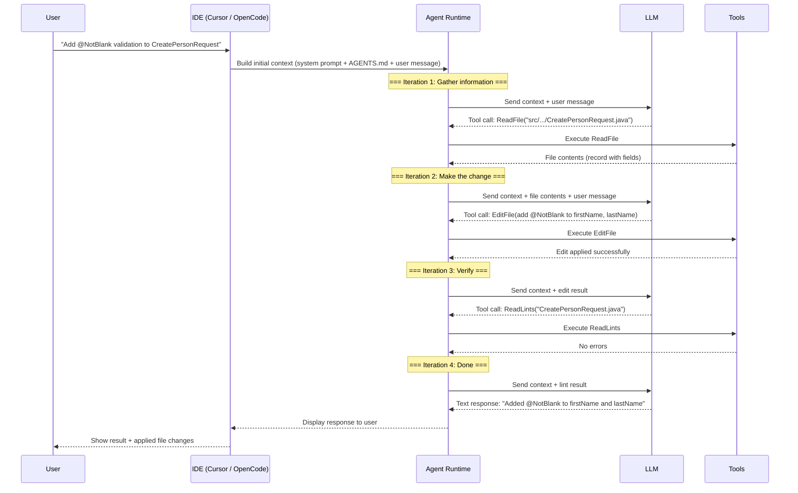
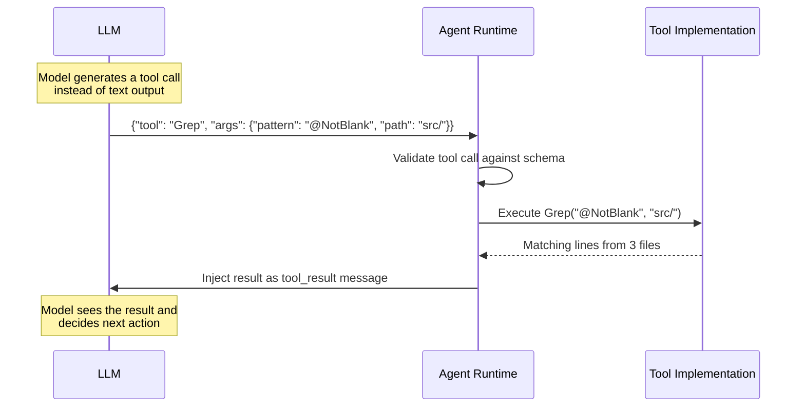
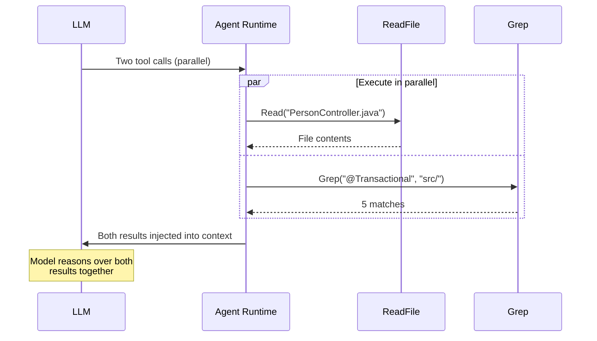
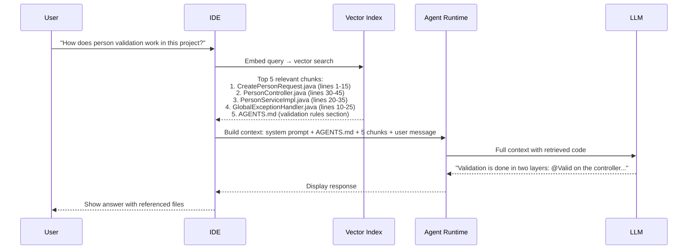
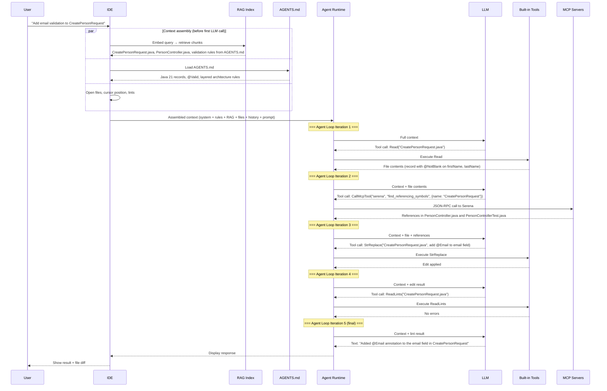

# Section 2: How AI Assistants Actually Work

Section 1 taught you the setup basics.
This section looks under the hood and explains **how they work** -- the
runtime architecture that turns your natural-language prompt into code
changes, file edits, and shell commands.

Understanding these internals lets you:
- Debug situations where the assistant misreads your project
- Write better AGENTS.md and SKILL.md files by knowing how they are consumed
- Choose the right tool (MCP, RAG, direct file read) for each situation
- Reason about context window limits instead of guessing

| Section | Topic |
|---------|-------|
| [1. The Agent Loop](#1-the-agent-loop) | Perceive → reason → act cycle |
| [2. Tools](#2-tools----how-the-llm-acts-on-the-world) | Built-in tools, execution sequence, parallel calls |
| [3. MCP](#3-mcp----model-context-protocol) | Plug-in protocol for external tools (see Section 13) |
| [4. RAG](#4-rag----retrieval-augmented-generation) | Embed → retrieve → inject pipeline |
| [5. Context Engineering](#5-context-engineering) | Window anatomy, token budget, context rot |
| [6. Prompt Engineering](#6-prompt-engineering----the-users-layer) | Where your prompt fits in the layered model |
| [End-to-End Flow](#putting-it-all-together-end-to-end-request-flow) | Full request walkthrough |
| [Common Misconceptions](#common-misconceptions) | What AI assistants do not do |

---

## 1. The Agent Loop

Every AI coding assistant -- Cursor, OpenCode, GitHub Copilot
Chat -- runs the same fundamental loop at its core. This loop is what makes
an assistant an **agent** rather than a simple chatbot.

### The Perception-Reasoning-Action Cycle

A basic chatbot does one thing: receive a message, produce a response. An
agent does something fundamentally different -- it **acts on the world** and
**observes the result** in a continuous loop until the task is done.

```text
┌──────────────────────────────────────────────────────────┐
│                     The Agent Loop                        │
│                                                          │
│   ┌──────────┐                                           │
│   │  Perceive │◄──────────────────────────────┐          │
│   │  (observe │                               │          │
│   │  results) │                               │          │
│   └────┬──────┘                               │          │
│        │                                      │          │
│        ▼                                      │          │
│   ┌──────────┐                           ┌────┴──────┐   │
│   │  Reason   │                           │  Observe   │   │
│   │  (LLM     │                           │  (read     │   │
│   │  decides) │                           │  result)   │   │
│   └────┬──────┘                           └────▲──────┘   │
│        │                                      │          │
│        ▼                                      │          │
│   ┌──────────┐        ┌───────────┐     ┌────┴──────┐   │
│   │  Decide   │───────►│  Execute  │────►│  Tool     │   │
│   │  (pick    │        │  tool call│     │  returns  │   │
│   │  action)  │        └───────────┘     │  output   │   │
│   └──────────┘                           └───────────┘   │
│                                                          │
│   Loop continues until: task is complete, or the model   │
│   decides no more actions are needed.                    │
└──────────────────────────────────────────────────────────┘
```

### Step-by-Step: How a Single Request Flows

When you type "Add `@NotBlank` validation to `CreatePersonRequest`" in your
IDE, here is exactly what happens:



Key observations:

1. **The LLM does not edit files directly.** It produces structured tool calls
   that the agent runtime executes. The LLM never touches your filesystem.

2. **Each iteration adds to the context.** The agent appends each tool result
   to the conversation history before calling the LLM again.

3. **The LLM decides when to stop.** When it produces a text response instead
   of a tool call, the loop ends.

4. **The loop is stateless between iterations at the model level.** The entire
   conversation (system prompt + all prior messages + all tool results) is
   re-sent to the LLM on every iteration. The LLM has no memory between
   calls -- only the ever-growing context window.

### What Makes an Agent Different from a Chatbot

| Aspect            | Chatbot                       | Agent                              |
|-------------------|-------------------------------|------------------------------------|
| Interaction       | One prompt → one response     | One prompt → N iterations          |
| Side effects      | None (text only)              | Reads files, writes code, runs commands |
| Observation       | None                          | Reads tool results, adapts         |
| Termination       | After first response          | When the model decides task is done |
| Context growth    | Fixed                         | Grows with each tool result        |

### Why This Matters for You

Understanding the agent loop explains several things you have already
experienced:

- **Why the assistant sometimes reads files you did not ask about**: it is
  gathering context in an early iteration before making changes.
- **Why long tasks can degrade in quality**: after many iterations the context
  window fills up and older information falls out of the model's attention.
- **Why "think step by step" works**: it forces the model to spend one or
  more iterations on reasoning before it starts writing code
  (see [Section 4](04-prompt-techniques.md)).

---

## 2. Tools -- How the LLM Acts on the World

The agent loop runs on **tools**. Without tools, the LLM can only produce
text. With tools, it can read files, edit code, run tests, search the
codebase, and interact with external systems.

### What Is a Tool?

A tool is a function exposed to the LLM via a JSON schema. The schema tells
the model: "here is a capability you can invoke, here are its parameters,
here is what it returns."

The LLM never executes the tool. It produces a **structured tool call** (a
JSON object), and the agent runtime executes it.

Example -- a simplified `ReadFile` tool schema:

```json
{
  "name": "ReadFile",
  "description": "Read the contents of a file at the given path",
  "parameters": {
    "type": "object",
    "properties": {
      "path": {
        "type": "string",
        "description": "Absolute path to the file"
      },
      "offset": {
        "type": "integer",
        "description": "Line number to start reading from (optional)"
      },
      "limit": {
        "type": "integer",
        "description": "Number of lines to read (optional)"
      }
    },
    "required": ["path"]
  }
}
```

When the LLM decides it needs to read a file, it does **not** output
"let me read the file." It outputs a structured JSON call:

```json
{
  "tool": "ReadFile",
  "arguments": {
    "path": "/home/dev/project/src/main/java/com/example/demo/dto/CreatePersonRequest.java"
  }
}
```

The agent runtime intercepts this, executes the file read, and injects
the result back into the conversation as a tool result message.

### Tool Execution Sequence



### Built-In Tools in AI Assistants

Each assistant ships with a fixed set of built-in tools. The model cannot
use tools that are not registered. Here is what Cursor provides:

| Tool          | Purpose                                    | Side Effects |
|---------------|--------------------------------------------|--------------|
| Read          | Read file contents                         | None         |
| Grep          | Search file contents with regex            | None         |
| Glob          | Find files by name pattern                 | None         |
| SemanticSearch| Find code by meaning (vector search)       | None         |
| StrReplace    | Replace exact string in a file             | Writes file  |
| Write         | Create or overwrite a file                 | Writes file  |
| Shell         | Execute a shell command                    | Arbitrary    |
| ReadLints     | Read linter/compiler diagnostics           | None         |
| Task          | Launch a subagent (see [Section 11](11-agents-subagents.md)) | Spawns agent |
| CallMcpTool   | Call an MCP server tool (see Section 13)   | Varies       |

OpenCode has equivalent tools with different names but
the same fundamental categories: **read**, **search**, **edit**, **execute**,
and **delegate**.

### How the Model Chooses Which Tool to Call

The LLM does not follow a decision tree or a routing table. Tool selection
is a **learned behavior** that emerges from three inputs the model evaluates
on every iteration of the agent loop:

1. **Tool descriptions** -- the `description` field in every tool schema
2. **The current task** -- what the user asked for, plus what was learned
   in prior iterations
3. **Training** -- RLHF and tool-use fine-tuning that teach the model
   when each tool type is appropriate

Here is how the model reasons (simplified):

```text
┌──────────────────────────────────────────────────────────────────┐
│               Tool Selection Decision Process                    │
│                                                                  │
│  Input: User intent + all tool schemas in system prompt          │
│                                                                  │
│  Step 1: UNDERSTAND THE NEED                                     │
│     What information or action does the current step require?    │
│     → "I need to know which files reference PersonService"       │
│                                                                  │
│  Step 2: MATCH AGAINST TOOL DESCRIPTIONS                         │
│     Scan all available tool descriptions for semantic match:     │
│     ┌──────────────────────────────────────────────────────┐     │
│     │ Grep: "Search file contents with regex"              │     │
│     │ SemanticSearch: "Find code by meaning"               │     │
│     │ find_referencing_symbols: "Find all symbols that     │     │
│     │   reference the given symbol, with context"          │     │
│     │ git_log: "Get commit history for a file"             │     │
│     │ run_query: "Execute a SQL query"                     │     │
│     └──────────────────────────────────────────────────────┘     │
│                                                                  │
│  Step 3: RANK BY RELEVANCE                                       │
│     Grep → can find text "PersonService" but misses indirect     │
│            references (via variable types, subclasses)           │
│     find_referencing_symbols → designed exactly for this task,   │
│            returns structured reference data with context        │
│                                                                  │
│  Step 4: SELECT AND CALL                                         │
│     → find_referencing_symbols wins (highest relevance)          │
│                                                                  │
│  The model can also pick MULTIPLE tools in parallel              │
│  if the tasks are independent (see Parallel Tool Calls below).   │
└──────────────────────────────────────────────────────────────────┘
```

Common patterns the model has learned:

| User Intent                            | Likely Tool Choice    | Why                                |
|----------------------------------------|-----------------------|------------------------------------|
| "Find where X is used"                 | Grep or MCP find_refs | Text match vs semantic match       |
| "Read this file"                       | Read                  | Direct file access                 |
| "Change this code"                     | StrReplace or Write   | Modify existing vs create new      |
| "Run the tests"                        | Shell                 | Command execution                  |
| "Search the codebase for concepts"     | SemanticSearch        | Meaning-based retrieval            |
| "Interact with an external system"     | CallMcpTool           | Only MCP can reach external systems|

The critical insight: **tool descriptions are the primary routing mechanism**.
The model matches the semantics of what it needs against the `description`
field of every available tool. This is why well-written MCP tool descriptions
are essential -- a poorly described tool will never be selected, even if it
is the perfect tool for the job. More on this in [Section 13](13-mcp-servers.md).

### Parallel Tool Calls

Modern assistants support **parallel tool execution**. When the model
determines that two tool calls are independent, it can emit both in a
single response and the runtime executes them simultaneously:



This is why you sometimes see the assistant reading multiple files
at once -- it is a deliberate optimization to reduce the number of
loop iterations.

---

## 3. MCP -- Model Context Protocol

MCP (Model Context Protocol) is an open standard for connecting **external
capabilities** to your AI assistant without modifying the IDE itself.

Built-in tools are fixed by the vendor. MCP provides a plug-in protocol
so the assistant can reach systems the IDE does not ship with — language
servers, databases, issue trackers, Git history, and more.

MCP tools appear in the model's tool list **exactly like built-in tools**
(Read, Grep, Shell, etc.). The agent loop does not distinguish them; on each
iteration the model picks the best-matching tool description. You can steer
preferences in `AGENTS.md` (see [Section 8](08-agents-md.md)).

**Full coverage** — architecture, agent-loop integration, tool resolution
heuristics, parallel calls, failure modes, configuration, and custom servers —
is in [Section 13: MCP Servers](13-mcp-servers.md).

---

## 4. RAG -- Retrieval-Augmented Generation

RAG is the mechanism that lets the assistant answer questions about your
codebase without reading every file into the context window.

### The Problem RAG Solves

An LLM's context window is finite (typically 128K-200K tokens). A
medium-sized Java project has millions of tokens of source code. The
model cannot see everything at once.

Without RAG, the model must rely on:
1. Files you explicitly open in your IDE
2. Files it reads one-by-one via tool calls (slow, wastes iterations)
3. Its training data (outdated, not project-specific)

RAG bridges this gap by **pre-indexing** your codebase and retrieving
only the relevant fragments when needed.

### The RAG Pipeline: Embed → Retrieve → Inject

```text
┌──────────────────────────────────────────────────────────────────┐
│                      RAG Pipeline                                │
│                                                                  │
│  1. INDEX (offline, runs when you open the project)              │
│     ┌──────────┐     ┌──────────┐     ┌──────────────────┐      │
│     │ Source    │────►│ Chunker  │────►│ Embedding Model  │      │
│     │ Files    │     │ (split   │     │ (text → vector)  │      │
│     │          │     │  into    │     │                  │      │
│     │ .java    │     │  chunks) │     │ [0.12, -0.03,    │      │
│     │ .xml     │     │          │     │  0.87, ...]      │      │
│     │ .yaml    │     └──────────┘     └──────┬───────────┘      │
│     └──────────┘                             │                  │
│                                              ▼                  │
│                                     ┌──────────────────┐        │
│                                     │ Vector Database   │        │
│                                     │ (local index)     │        │
│                                     └──────────────────┘        │
│                                                                  │
│  2. RETRIEVE (at query time)                                     │
│     ┌──────────────┐     ┌──────────────┐     ┌─────────────┐   │
│     │ User query   │────►│ Embed query  │────►│ Nearest     │   │
│     │ "How does    │     │ (same model) │     │ neighbor    │   │
│     │  person      │     │              │     │ search      │   │
│     │  validation  │     └──────────────┘     └──────┬──────┘   │
│     │  work?"      │                                 │          │
│     └──────────────┘                                 ▼          │
│                                              Top-K chunks       │
│                                                                  │
│  3. INJECT (into prompt)                                         │
│     ┌──────────────────────────────────────────────────────┐     │
│     │ System prompt + AGENTS.md + retrieved chunks +       │     │
│     │ conversation history + user message                  │     │
│     │                                    ──► LLM ──► answer│     │
│     └──────────────────────────────────────────────────────┘     │
└──────────────────────────────────────────────────────────────────┘
```

### Step-by-Step: RAG in Action



### RAG vs Direct File Read vs MCP

These three mechanisms all serve the same goal -- getting relevant
information into the LLM's context -- but they work differently:

| Mechanism     | When It Runs                  | Who Decides What to Fetch     | Latency   | Precision       |
|---------------|-------------------------------|-------------------------------|-----------|-----------------|
| RAG           | Automatically at query time   | Vector similarity             | Low       | Approximate     |
| Direct Read   | When model calls Read tool    | The model (explicit decision) | Medium    | Exact           |
| MCP           | When model calls MCP tool     | The model (explicit decision) | Medium    | Exact + semantic|

In practice, all three work together in a single request:

1. **RAG** retrieves initial context before the first LLM call
2. **The model** reads additional files via **Read** tool calls
3. **The model** queries MCP servers for semantic information (references,
   symbol types) that neither RAG nor file reads provide

### How Indexing Works in Practice

When you open a project in Cursor or OpenCode, the IDE:

1. **Scans** all non-ignored files (respects `.gitignore`)
2. **Chunks** each file into segments (~100-500 tokens each)
3. **Embeds** each chunk using a small, fast embedding model
4. **Stores** the vectors in a local database

This index is updated incrementally as you edit files. The index is
what powers the `SemanticSearch` tool and the automatic context
retrieval that happens before each LLM call.

### RAG Quality Depends on Your Code

RAG retrieval quality is directly affected by:

- **Naming**: Well-named classes and methods produce better embeddings.
  `PersonValidationService` retrieves better than `Utils2`.
- **Comments**: Javadoc and meaningful comments improve chunk relevance.
- **File organization**: Small, focused files produce better chunks than
  4000-line God classes.
- **AGENTS.md**: Often retrieved as a top chunk because it contains
  dense, project-specific terminology.

---

## 5. Context Engineering

Context engineering is the discipline of controlling **what information
the LLM sees** when it processes your request. The same model produces
dramatically different results depending on what fills the context window.

### The Context Window Stack

When the agent runtime calls the LLM, it assembles context from multiple
layers (roughly in this order):

```text
┌──────────────────────────────────────────────────────────────────┐
│                    LLM Context Window (~200K tokens)              │
│                                                                  │
│  1. System prompt + tool schemas (built-in + MCP)           ~5K   │
│  2. AGENTS.md / project rules                             ~2K   │
│  3. SKILL.md (if activated)                               ~1K   │
│  4. RAG-retrieved code chunks                             ~5K   │
│  5. Open files / cursor position                          ~3K   │
│  6. Conversation history                              variable  │
│  7. Tool results (Read, Grep, Shell, MCP, …)          variable  │
│  8. Your message (the prompt)                          ~0.5K   │
└──────────────────────────────────────────────────────────────────┘
```

As conversation history and tool outputs accumulate, **context rot** sets in:
instructions at the beginning (including AGENTS.md) get harder to follow,
and each agent-loop iteration re-sends the full accumulated context.

### Why AGENTS.md Is the Highest-Leverage Context

AGENTS.md sits near the top of the stack. It is:

1. **Always present** — injected on every LLM call
2. **Early in context** — models attend more to early tokens
3. **Under your control** — unlike the IDE system prompt
4. **Small but dense** — 500–2000 tokens of pure signal

A well-written AGENTS.md ([Section 8](08-agents-md.md)) beats per-prompt
tweaks because those rules are seen on every iteration of every agent loop.

### Where to Go Deeper

| Topic | Section |
|-------|---------|
| Context rot, token budget, task-type strategies | [Section 6: Context](06-context.md) |
| Child sessions, compaction, WORKFLOW_STATE handoff | [Section 12: Agent Sessions](12-agent-sessions.md) |
| Subagent orchestration and phase gates | [Section 11: Agents & Subagents](11-agents-subagents.md) |


---

## 6. Prompt Engineering -- The User's Layer

Prompt engineering is **your contribution** to the context window.
While the IDE controls the system prompt, RAG controls the retrieved
chunks, and AGENTS.md controls the project rules -- your prompt is the
direct instruction that drives the model's behavior for this specific
request.

Sections [3 (Prompting)](03-prompting.md) and
[4 (Prompt Techniques)](04-prompt-techniques.md) cover this topic in
depth. Here we place prompt engineering in the context of the full
architecture you have just learned.

### Where Your Prompt Fits

Your prompt is the **last thing** the model sees in the context window.
Everything above it (system prompt, AGENTS.md, RAG chunks, tool
results) has already been assembled by the IDE and agent runtime. Your
prompt rides on top of that assembled context.

```text
┌──────────────────────────────────────────────────────┐
│  Context assembled by IDE/Agent    (you don't write) │
│  ├── System prompt                                   │
│  ├── AGENTS.md rules               (you write once)  │
│  ├── SKILL.md                      (you write once)  │
│  ├── RAG chunks                    (automatic)       │
│  ├── Open files                    (you choose)      │
│  ├── Conversation history          (accumulated)     │
│  └── Tool results                  (accumulated)     │
├──────────────────────────────────────────────────────┤
│  Your Prompt                       (you write now)   │
│  "Add @NotBlank to CreatePersonRequest fields"       │
└──────────────────────────────────────────────────────┘
```

### Prompt Engineering Is Context Engineering

When you apply the techniques from Sections 3 and 4, you are not just
writing a better question -- you are engineering the bottom layer of
the context stack:

| Technique (Section 3/4)       | What It Does to the Context                     |
|------------------------------|--------------------------------------------------|
| CO-STAR framework            | Adds role, style, audience, format to your message |
| Few-shot examples            | Adds input-output pairs the model can pattern-match |
| Chain-of-thought             | Forces an extra reasoning iteration in the agent loop |
| Output primers               | Anchors the model's output format                |
| Role assignment              | Overrides or reinforces the AGENTS.md persona    |
| Task decomposition           | Splits one large context into multiple focused ones |

### The Layered Defense Model

Think of context engineering as a layered defense where each layer
catches what the previous one missed:

```
Layer 1: AGENTS.md    → Catches project-wide issues (wrong style, wrong patterns)
Layer 2: SKILL.md     → Catches task-specific issues (wrong format, missing steps)
Layer 3: Your prompt  → Catches request-specific issues (wrong scope, wrong output)
```

If your AGENTS.md says "use Java records for DTOs" and your SKILL.md
says "generate tests following given/when/then," then your prompt only
needs to say "generate tests for PersonService.create()" -- the layers
above handle the conventions.

This is why investing in AGENTS.md (Section 8) and skills (Section 9)
pays off exponentially: every future prompt is shorter and more
effective because the persistent context layers handle the boilerplate.

---

## Putting It All Together: End-to-End Request Flow

Here is the complete flow when you type a request in your AI assistant,
showing every mechanism from this section working together:



This diagram shows every concept from this section:

1. **RAG** (section 4) retrieves initial context before the first LLM call
2. **Context engineering** (section 5) assembles the full context window
3. **The agent loop** (section 1) iterates through tool calls
4. **Built-in tools** (section 2) read and edit files
5. **MCP tools** ([Section 13](13-mcp-servers.md)) provide semantic code analysis
6. **Your prompt** (section 6) drives the entire flow

---

## Key Takeaways

| Concept              | One-Sentence Summary                                                      |
|----------------------|---------------------------------------------------------------------------|
| Agent Loop           | The LLM reasons and calls tools in a loop until the task is done.         |
| Tools                | Structured functions the LLM invokes via JSON -- it never touches your filesystem directly. |
| Tool Selection       | The model picks tools by matching task intent against tool descriptions -- specificity and description quality determine which tool wins. |
| MCP                  | A plug-in protocol that adds external tools to the model's capabilities.  |
| RAG                  | Pre-indexed codebase search that injects relevant code before the LLM sees your prompt. |
| Context Engineering  | Controlling what the LLM sees across all layers: system prompt, rules, RAG, files, history, prompt. |
| Context Rot          | Output quality degrades as context grows -- start fresh conversations and use subagents to stay in the high-quality zone. |
| Prompt Engineering   | Your direct instruction -- the last and most specific layer of the context stack. |

---

## Further Reading

- Anthropic: *Building Effective Agents* (2024) -- agent loop patterns
- Anthropic: *Model Context Protocol Specification* -- MCP standard
- Lewis et al.: *Retrieval-Augmented Generation for Knowledge-Intensive NLP Tasks* (2020) -- original RAG paper
- Liu et al.: *Lost in the Middle: How Language Models Use Long Contexts* (2023) -- U-shaped attention and context rot
- Section 8: [AGENTS.md](08-agents-md.md) -- writing the project context layer
- Section 13: [MCP Servers](13-mcp-servers.md) -- architecture, tool resolution, configuration
- Section 11: [Agents & Subagents](11-agents-subagents.md) -- orchestrating multiple agent loops
- Section 3: [Prompting](03-prompting.md) -- CO-STAR and 26 principles
- Section 4: [Prompt Techniques](04-prompt-techniques.md) -- zero-shot, few-shot, chain-of-thought
- Section 5: [Thinking & Reasoning](05-llm-models.md) -- model selection and cost

## Agent Loop Diagram with Tool Names (Cursor)

The diagram below shows the complete agent loop as Cursor implements it,
with the concrete tool names the LLM can call at each stage.

```text
┌──────────────────────────────────────────────────────────────────────────────┐
│                     Cursor Agent Loop - Full Cycle                           │
│                                                                              │
│  ┌─────────────────────────────────────────────────────────────────────────┐  │
│  │  STEP 1 - User Prompt                                                  │  │
│  │  Developer types a message in the chat panel.                          │  │
│  └────────────────────────────────┬────────────────────────────────────────┘  │
│                                   ▼                                          │
│  ┌─────────────────────────────────────────────────────────────────────────┐  │
│  │  STEP 2 - Context Assembly                                             │  │
│  │  The IDE builds the LLM input by concatenating:                        │  │
│  │    • System prompt (model persona, safety rules, tool schemas)         │  │
│  │    • AGENTS.md (project rules, loaded on every call)                   │  │
│  │    • Active SKILL.md (if a skill matches)                              │  │
│  │    • RAG-retrieved code chunks (vector similarity search)              │  │
│  │    • Open files & cursor position                                      │  │
│  │    • Conversation history + prior tool results                         │  │
│  │    • The user message itself                                           │  │
│  └────────────────────────────────┬────────────────────────────────────────┘  │
│                                   ▼                                          │
│  ┌─────────────────────────────────────────────────────────────────────────┐  │
│  │  STEP 3 - LLM Call                                                     │  │
│  │  The assembled context is sent to the model (e.g., Claude Sonnet).     │  │
│  │  The model produces EITHER a text response OR one or more tool calls.  │  │
│  └────────────┬─────────────────────────────────────┬─────────────────────┘  │
│               │ Text response                       │ Tool call(s)           │
│               ▼                                     ▼                        │
│  ┌────────────────────────┐      ┌────────────────────────────────────────┐  │
│  │  DONE - Display to     │      │  STEP 4 - Tool Selection               │  │
│  │  user, loop ends.      │      │  The model picks from:                 │  │
│  └────────────────────────┘      │                                        │  │
│                                  │  Read          - read file contents    │  │
│                                  │  Grep          - regex search          │  │
│                                  │  Glob          - find files by pattern │  │
│                                  │  SemanticSearch - find code by meaning │  │
│                                  │  StrReplace    - edit a file in place  │  │
│                                  │  Write         - create/overwrite file │  │
│                                  │  Shell         - run a shell command   │  │
│                                  │  ReadLints     - check linter errors   │  │
│                                  │  Task          - launch a subagent     │  │
│                                  │  CallMcpTool   - call an MCP server    │  │
│                                  └───────────────────┬────────────────────┘  │
│                                                      ▼                       │
│  ┌─────────────────────────────────────────────────────────────────────────┐  │
│  │  STEP 5 - Tool Execution                                               │  │
│  │  The agent runtime executes the tool call(s). Multiple independent     │  │
│  │  calls can run in parallel. The LLM never touches the filesystem -     │  │
│  │  the runtime does.                                                     │  │
│  └────────────────────────────────┬────────────────────────────────────────┘  │
│                                   ▼                                          │
│  ┌─────────────────────────────────────────────────────────────────────────┐  │
│  │  STEP 6 - Result Appended to Context                                   │  │
│  │  Tool output is injected as a tool_result message. The context grows.  │  │
│  └────────────────────────────────┬────────────────────────────────────────┘  │
│                                   ▼                                          │
│  ┌─────────────────────────────────────────────────────────────────────────┐  │
│  │  STEP 7 - Next LLM Call                                                │  │
│  │  The ENTIRE context (system + rules + history + all tool results) is   │  │
│  │  re-sent to the LLM. The model decides: call another tool, or produce │  │
│  │  a final text response. Loop back to STEP 3.                          │  │
│  └─────────────────────────────────────────────────────────────────────────┘  │
│                                                                              │
│  The loop continues until the LLM produces text instead of a tool call.     │
│  A typical task takes 3-8 iterations. Complex tasks can exceed 15.           │
└──────────────────────────────────────────────────────────────────────────────┘
```

**Tool-by-tool breakdown:**

| Tool            | Category | What It Does                                                  |
|-----------------|----------|---------------------------------------------------------------|
| `Read`          | Observe  | Reads a file by path, optionally a line range                 |
| `Grep`          | Observe  | Searches file contents with a regex pattern (ripgrep)         |
| `Glob`          | Observe  | Finds files matching a name pattern (`**/*.java`)             |
| `SemanticSearch`| Observe  | Finds code by meaning via the project's vector index          |
| `StrReplace`    | Act      | Replaces an exact string in a file (surgical edit)            |
| `Write`         | Act      | Creates a new file or overwrites an existing one              |
| `Shell`         | Act      | Runs an arbitrary shell command (`mvn test`, `git status`)    |
| `ReadLints`     | Observe  | Returns linter/compiler diagnostics for a file                |
| `Task`          | Delegate | Spawns a subagent with its own fresh context window           |
| `CallMcpTool`   | Extend   | Calls any tool from a connected MCP server                    |

---

## Common Misconceptions

**"The AI remembers my previous sessions."**
It does not. Each conversation starts with a blank context window. The
only persistence comes from files on disk — `AGENTS.md`, rules, and your
source code. If the assistant seems to "remember" something, it is
because it re-read a file or RAG re-retrieved the same chunk.
See [12-agent-sessions.md](12-agent-sessions.md) for session types, lifecycle, and
cross-session handoff patterns.

**"The AI reads my entire codebase."**
The context window is finite (128K-200K tokens). A medium Java project
has millions of tokens. The assistant sees only what RAG retrieves, what
files you open, and what it explicitly reads via tool calls. Most of your
codebase is invisible to any single LLM call.

**"More context is always better."**
Attention is a finite resource. Adding irrelevant files, verbose
comments, or redundant rules dilutes the model's attention on what
matters (section 5 — context rot). A focused 20K-token context
outperforms a noisy 150K-token one. Quality of context beats quantity.

**"The AI understands my code like a human."**
The model processes tokens, not semantics. It does not "understand" that
your `PersonService` implements a repository pattern — it pattern-matches
against its training data and the tokens in context. This is why explicit
rules in `AGENTS.md` are necessary: they provide the architectural intent
that the model cannot infer from code structure alone.

**"The AI executes code to test it."**
The LLM never runs code internally. When it appears to "test" something,
it is either (a) calling the `Shell` tool to run a command in your
terminal, or (b) simulating execution in its text output (which can be
wrong). Always verify generated code by running your own tests.

---

## Quick-Reference Cheat Sheet

| Concept           | One-Sentence Summary                                                                 |
|-------------------|--------------------------------------------------------------------------------------|
| Agent Loop        | The LLM calls tools in a loop (perceive → reason → act → observe) until the task is done. |
| Tools             | JSON-described functions (Read, Grep, Shell, etc.) that the runtime executes on behalf of the LLM. |
| MCP               | An open protocol for plugging external tool servers (database, git, code analysis) into the agent. |
| RAG               | Pre-indexed vector search that retrieves relevant code fragments before the LLM sees your prompt. |
| Context Window    | The finite (~200K token) input to the LLM, assembled from system prompt, AGENTS.md, RAG, files, history, and your message. |
| Context Rot       | Output quality degrades as context fills up — start fresh conversations and use subagents. |
| Tool Descriptions | The primary mechanism for tool selection — the LLM picks tools by matching intent against descriptions. |
| Parallel Calls    | Independent tool calls can execute simultaneously, reducing the number of agent loop iterations. |

---

## Next Section

Proceed to [Section 3: Prompting](03-prompting.md) to learn the CO-STAR
framework and the 26 principles of effective prompting.

**Before moving on:**
- Re-read your project's AGENTS.md with the context window anatomy in mind
- Check which MCP servers are connected in your IDE settings
