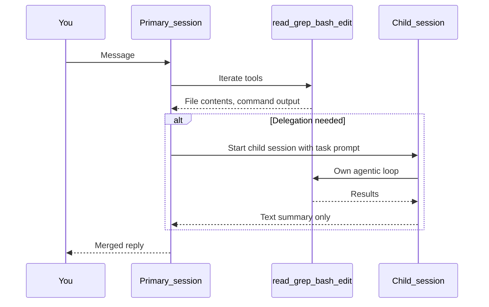

# Section 14: Agent Sessions

A **session** is a single conversation thread with its own isolated context window.
Sessions are stateless between conversations — the AI has no memory of prior sessions
unless you explicitly re-inject context (see [Section 2: How AI Assistants Work](02-how-ai-assistants-work.md)).

Related: [Section 12: Agents & Subagents](12-agents-subagents.md) — orchestration patterns ·
[Section 6: Context](06-context.md) — context window fundamentals ·
[opencode-agent-patterns/](opencode-agent-patterns/) — OpenCode-specific session mechanics

| Section | Topic |
|---------|-------|
| [Session Types](#session-types) | Primary, child, fresh — behavior and context |
| [Session Lifecycle](#session-lifecycle) | Message flow, tool iteration, delegation diagram |
| [Child Session Mechanics](#child-session-mechanics) | What children receive, what flows back |
| [When to Split a Session](#when-to-split-a-session) | Step count, phase gates, compaction triggers |
| [Compaction](#compaction) | What survives, what is discarded, recovery |
| [Cross-Session Continuity](#cross-session-continuity) | WORKFLOW_STATE.md pattern |
| [OpenCode Session Specifics](#opencode-session-specifics) | TUI, steps limit, doom_loop config |

---

## Session Types

| Type | Description | Context |
|------|-------------|---------|
| **Primary session** | Main conversation thread (Build / Plan or equivalent) | Accumulates full history; grows with every tool call |
| **Child session** | Spawned by the primary for one bounded subagent task | Fresh context; receives task prompt only; returns text summary |
| **Fresh session** | New conversation started explicitly after a phase gate or context reset | Clean context window; re-inject only what the new phase needs |

A single agent role (e.g. "Explore") can participate in many independent child sessions during one workflow.
Session ≠ agent: the agent is the role and its instructions; the session is the execution context.

---

## Session Lifecycle



### How context accumulates within a session

Every LLM call in a session re-sends the **full accumulated conversation** plus all prior tool outputs:

```text
Step 1:  [system][msg1]                                    → small
Step 2:  [system][msg1][tool1-req][tool1-out][reply1]      → grows
Step 5:  [system][msg1..][tool1..5-req+out][reply1..4]     → large
Step 15: same pattern × 3 → approaching compaction threshold
```

Growth is **quadratic**: tokens at step N ≈ sum of all tokens from steps 1 through N-1
plus the new tool output. At 20 steps with large outputs (file reads + test logs), a
typical triage session can consume 30 000–80 000 tokens in the primary context.

### Practical token cost reference

| Content | Approximate tokens |
|---------|-------------------|
| System prompt + AGENTS.md | 500–2 000 |
| One `mvn test` output (8 tests, 1 failure) | 1 000–2 000 |
| One Java source file (150 lines) | 500–800 |
| One `grep` result (20 hits) | 300–600 |
| Subagent summary (bullet list) | 100–300 |
| Full refactor diff (150-line class) | 400–1 000 |

For model window sizes and the 80% safe working budget, see [Section 6: Context](06-context.md).

---

## Child Session Mechanics

### What the child receives

A child session starts with a **fresh** context. It does NOT inherit the parent's chat history.
It receives only:

- System prompt (tool descriptions)
- `AGENTS.md` (project rules)
- The task prompt the primary (or you via `@mention`) provides

**Critical:** put file paths, constraints, acceptance criteria, and expected return format
in every delegation prompt. The child cannot recover missing context from the conversation.

### What flows back

| Direction | Content |
|-----------|---------|
| Parent → Child | Task prompt: goal, paths, constraints, return format |
| Child → Parent | Final text summary only (findings, commands run, files changed) |
| Parent → You | Synthesized report + recommendations |

### What subagents do NOT see

- Your full chat history (unless the primary explicitly pastes excerpts into the task prompt)
- Other subagents' raw tool outputs (only what the primary merges)
- Implicit team conventions (must be in `AGENTS.md` or the delegation prompt)

### Parallel child sessions

When the primary issues multiple `task` calls in one reasoning step, they can run
**concurrently** (subject to provider rate limits). One child failing does not cancel
the others — the parent receives each result (or error summary) and merges them.

```text
Primary:  @explore map package  +  bash mvn test  +  @general diagnose
          └─ child (concurrent) ─┘  └─ inline ─┘  └─ child (concurrent) ─┘
```

**Never parallelize writers on the same file** — parallel writes to the same file cause
the second write to silently overwrite the first.

---

## When to Split a Session

Start a new session when any of these apply:

- Step 10–12 reached in a single primary session (context is large; quadratic cost rising)
- A phase gate approved (triage approved → fresh Build session for implementation)
- Compaction summaries appear in replies (early context has been summarized away)
- Triage or planning chat is already long before implementation begins
- `steps` limit summary received — the summary is a compact re-entry point; continue in a fresh session rather than within the large context

**Passing state to the new session:** paste the approved plan directly (if it fits in ~20 lines)
or use a `WORKFLOW_STATE.md` file (see [Cross-Session Continuity](#cross-session-continuity) below).

---

## Compaction

Compaction is the automatic summarization that runs when the accumulated context approaches
the model's context window limit (~80–90% of the window, provider-dependent).

### What compaction preserves

- The last ~5–10 turns verbatim (exact count is provider-dependent)
- A model-generated summary paragraph of earlier work (key facts, decisions, file paths)

### What compaction discards

- Verbatim tool outputs from early turns (full file reads, long test logs, grep dumps)

### How to detect it

Compaction does not appear as a visible event in most tools. Signs:

- Replies suddenly "forget" constraints or file contents from early in the session
- Summaries become shorter or omit details you established 10+ messages ago

### Recovery

1. Re-inject critical constraints in your next message (paths, acceptance criteria, scope)
2. Point the agent at `WORKFLOW_STATE.md` if you maintain one
3. Start a fresh session with the approved plan pasted — do not rely on chat history alone

For the abstract context strategy, see [Section 6: Context — Compaction](06-context.md).

---

## Cross-Session Continuity

### WORKFLOW_STATE.md

A shared file that acts as a persistent handoff between sessions. It is a concrete
implementation of the [structured note-taking](06-context.md) strategy.

**Important:** `WORKFLOW_STATE.md` is a human convention — you create it (or ask Build
to create it) and paste its path into the task prompt. No tool loads it automatically.

```markdown
## Scope
- Section: com.example.demo.service.impl.PersonServiceImpl
- Acceptance: PersonServiceImplTest green, public API unchanged

## Plan (approved)
- Extract sumLineTotals, applyDiscount

## Implement status
- [ ] Done — General session 2

## Verify
- mvn test: (pending)
```

**Pattern:** Planner writes scope + plan → Implementor reads file, edits code, updates status
→ Verifier runs tests, pastes results into verify section. Debug by reading the file,
not by reconstructing chat history.

### When to use WORKFLOW_STATE.md vs. inline plan paste

| Situation | Approach |
|-----------|----------|
| Single Plan → Build transition, plan fits in ~20 lines | Paste the approved plan directly into the Build message |
| Session is past step 10 (context large) | Use `WORKFLOW_STATE.md` as the handoff |
| Multiple phases or sessions need the same acceptance criteria | Use `WORKFLOW_STATE.md` |
| Team handoff or resuming the next day | Use `WORKFLOW_STATE.md` |

---

## OpenCode Session Specifics

For the full OpenCode session treatment — session tree navigation (`Ctrl+Down`), `task` tool
mechanics, `@mention` vs primary delegation, `steps` limit, `doom_loop` config, and the
compaction / title / summary automatic agents — see
[opencode-agent-patterns/README.md](opencode-agent-patterns/README.md).

Brief reference:

| OpenCode mechanism | What it does |
|--------------------|-------------|
| Session tree | Left pane showing primary + child sessions; navigate with `Ctrl+Down` / `Up` |
| `Ctrl+Down` | Enter first child session to inspect subagent work |
| Compaction agent | Automatic; not visible in session tree; detected by reply behavior |
| Title agent | Generates session title automatically |
| Summary agent | Generates session summary on export |
| `steps` limit | Configured in `opencode.json`; forces a summary turn when reached |
| `doom_loop` | Detects 3+ identical tool calls; injects a stop/summarize prompt |

---

## Quick Reference

| Concept | One-Line Summary |
|---------|-----------------|
| Session | Single conversation thread with isolated context window |
| Primary session | Main thread; context accumulates with every tool call |
| Child session | Isolated subagent run; returns text summary only |
| Fresh session | New conversation; use after phase gates or context reset |
| Context growth | Quadratic — each step re-sends full history + all tool outputs |
| Session split triggers | Step 10–12, phase gate, compaction signs, pre-implementation |
| Compaction | Auto-summarizes early turns when context hits ~80–90% of window |
| WORKFLOW_STATE.md | File-based handoff; the concrete form of structured note-taking |
| Parallel child sessions | Concurrent child runs; never parallelize writers on same file |

---

## Next Section

Proceed to [Section 14: MCP Servers](14-mcp-servers.md) to learn how to
extend your AI assistant with external tools and data sources via the
Model Context Protocol.

## Further Reading

- [Section 2: How AI Assistants Work](02-how-ai-assistants-work.md) — agent loop, stateless sessions
- [Section 6: Context](06-context.md) — context window theory, token budget, context rot
- [Section 12: Agents & Subagents](12-agents-subagents.md) — orchestration patterns, phase gates
- [opencode-agent-patterns/README.md](opencode-agent-patterns/) — OpenCode-specific session mechanics, `steps` / `doom_loop` config, worked workflows
