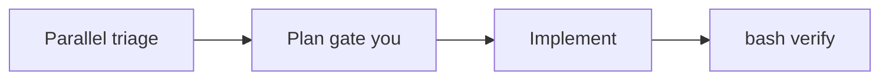
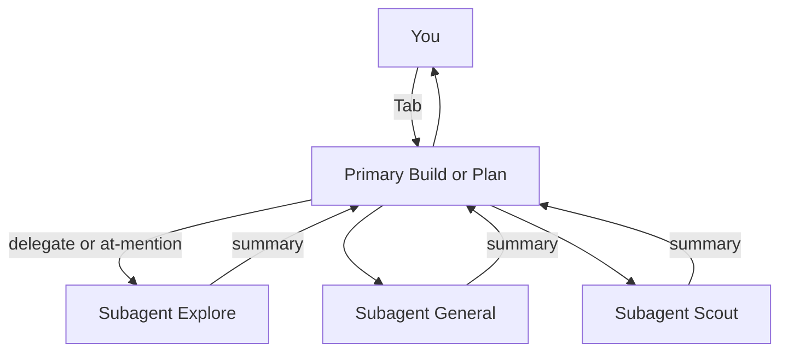
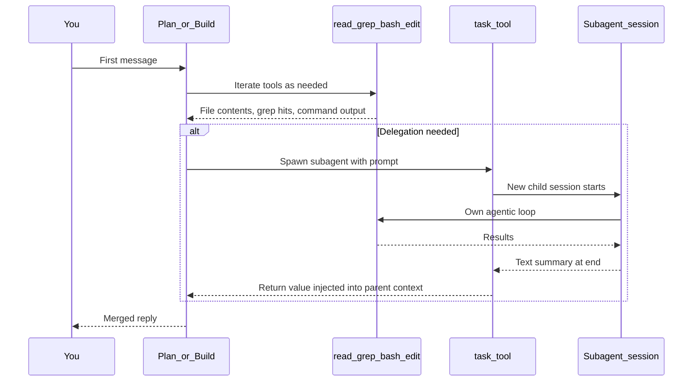
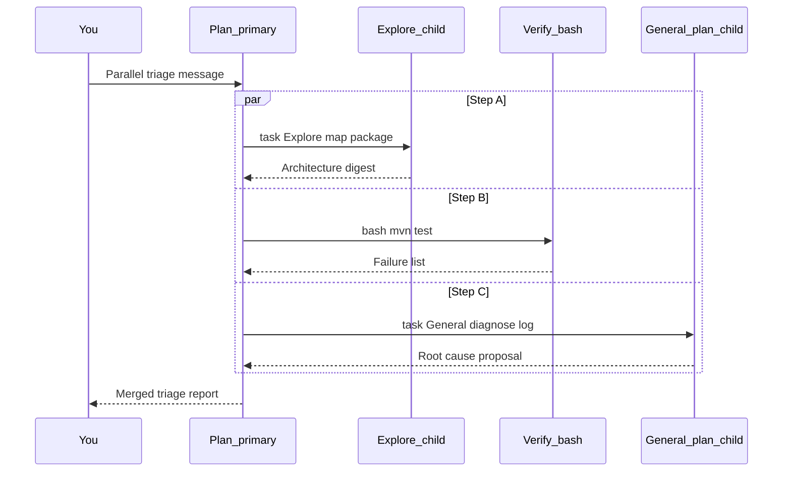
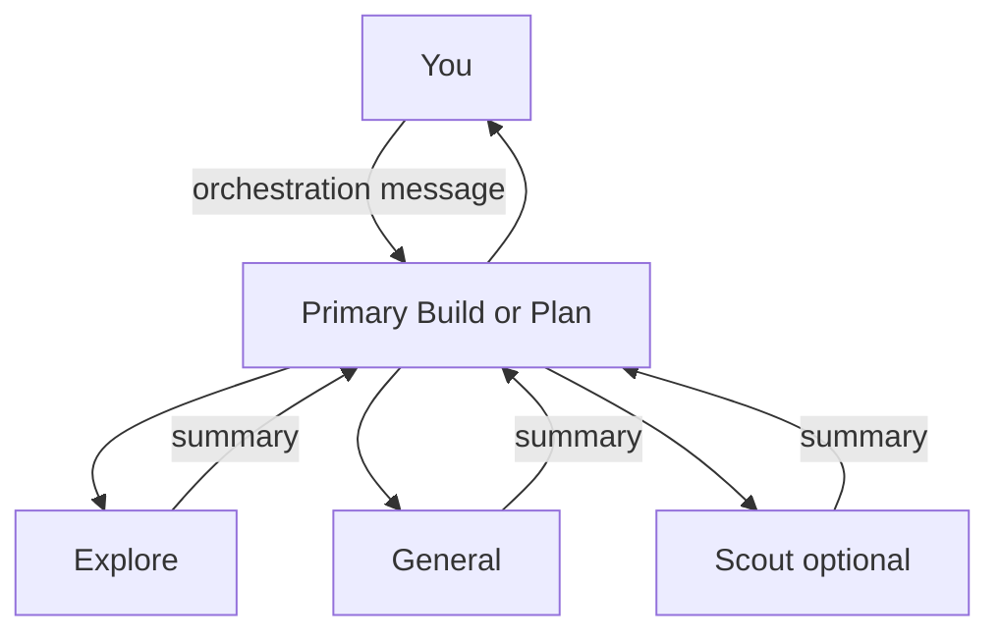
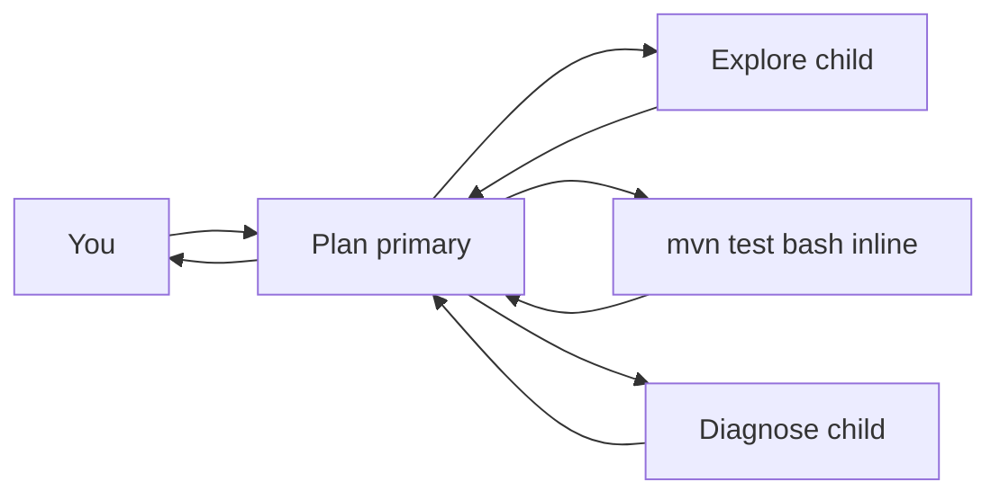
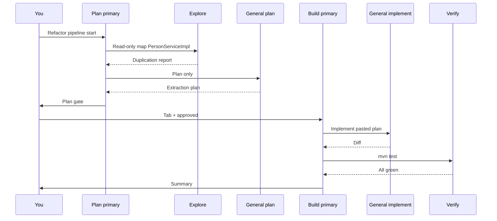
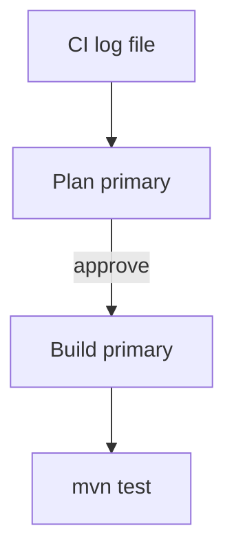
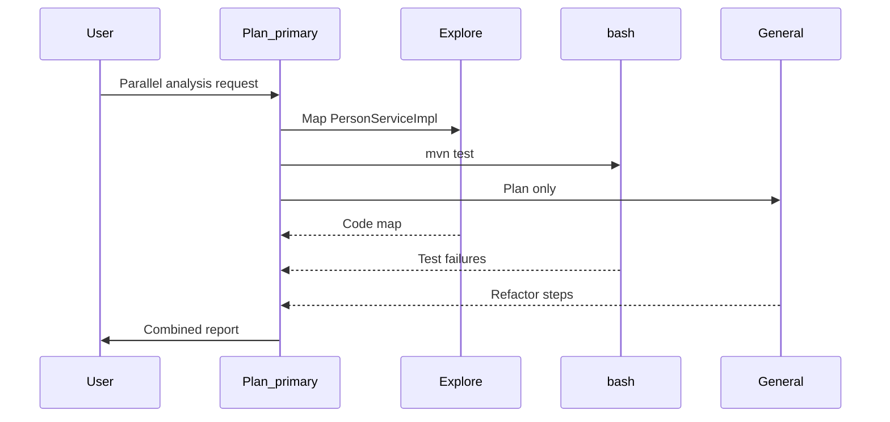

# OpenCode Agent Patterns

OpenCode-specific companion to [11-agents-subagents.md](../11-agents-subagents.md),
[12-agent-sessions.md](../12-agent-sessions.md), and [06-context.md](../06-context.md).

An **agentic workflow** is **you + a primary agent (Build or Plan) + subagents (General, Explore, Scout)** in **[OpenCode](https://opencode.ai)**.

Practice orchestration on [../templates/sample-project/](../templates/sample-project/) — not one chat doing everything alone.

---

## Core Concepts

| Concept | Description |
|------|-------------|
| [Agent Model](#agent-model) | Primary vs subagent vs agentic workflow |
| [Workflow Execution](#workflow-execution) | Execution internals, parallel agents, context |
| [Commands, Skills, and AGENTS.md](#commands-skills-and-agentsmd) | `/commands`, SKILL.md, AGENTS.md |
| [Token Efficiency](#token-efficiency-and-doom-loop-prevention) | Doom loops, `steps` limit |
| [Orchestration Principles](#orchestration-principles) | Phase gates, verify gates, work-splitting |

Optional: skim [tools/opencode-reference.md](tools/opencode-reference.md) (cheat sheet) and [tools/opencode-ecosystem.md](tools/opencode-ecosystem.md) (Java skills install).

---

## Workflow sections

| Section | Topic |
|---------|-------|
| [Parallel Triage](#parallel-triage-red-build) | Red build — parallel explore + bash + diagnose |
| [Refactor Pipeline](#refactor-pipeline) | Plan → implement → verify |
| [PR-Ready Workflow](#pr-ready-workflow) | CI log → diagnose → fix → verify |
| [Full Orchestration](#full-orchestration) | End-to-end session |
| [Anti-Patterns](#anti-patterns) | Failure patterns and recovery |

---

## Resources

| Type | Files |
|------|-------|
| **Templates** | [triage-session](templates/triage-session.md) · [refactor-pipeline](templates/refactor-pipeline.md) · [pr-review](templates/pr-review.md) · [hotfix](templates/hotfix.md) |
| **Playbooks** | [red-build-triage](playbooks/red-build-triage.md) · [safe-refactor](playbooks/safe-refactor.md) · [pre-pr-review](playbooks/pre-pr-review.md) · [incident-hotfix](playbooks/incident-hotfix.md) |
| **Tools** | [opencode-reference](tools/opencode-reference.md) · [opencode-ecosystem](tools/opencode-ecosystem.md) · [opencode-agents.example.json](tools/opencode-agents.example.json) |

Copy templates into `.opencode/commands/` in your repo; use playbooks as orchestration prompts.

---

## Demo project

```bash
cd ../templates/sample-project
mvn test -Dtest=PersonServiceImplTest   # 1 failure until fixed
```

[../templates/sample-project/README.md](../templates/sample-project/README.md) — project overview and setup.

---

## 0. For Java developers (orchestration)

You already write Java. This section is **how to run a team of agents**, not how to code.

See [Core Concepts](#core-concepts), [Workflow sections](#workflow-sections), and [Resources](#resources) at the top.

### 0.1 Agent model

A **subagent is not** the primary. Each subagent runs in a **child session** with isolated context.

Full agent model: [Agent Model](#agent-model).

### Orchestration patterns

| Pattern | Agents | Java use case |
|---------|--------|---------------|
| **Parallel triage** | `@explore` + bash + `@general` (diagnose) | Red CI / local `mvn test` failure |
| **Plan → implement** | `@explore` → `@general` plan → Build + `@general` implement | Safe `OrderService`-style refactor |
| **Verify gate** | Build bash after any General edit | `mvn test` / `mvn verify` — block merge without output |
| **Parallel research** | 2× `@explore` (different packages) | Map legacy before API change |
| **PR-ready** | Plan + log + `@general` minimal fix + bash | CI log → fix → green |



### Sequential plan → implement

Full worked example with orchestration prompts, plan approval guidance, and review checklist: [Refactor Pipeline](#refactor-pipeline).

### Review checklist

Before you accept agent work as PR-ready:

- [ ] **Scope:** Only expected paths (e.g. `com.example.demo`, not `pom.xml` surprises)
- [ ] **Tests:** Shell output shows `Failures: 0` (not "should pass")
- [ ] **Public API:** No signature changes unless ticket allows
- [ ] **Diff size:** Hotfix = minimal; refactor = focused module
- [ ] **Root cause:** Diagnosis tied log line to code line

### Anti-patterns (short)

Parallel **writers** on one file; implement before plan approval; skipping verify after General. Full list: [Anti-Patterns](#anti-patterns).

---

- [Quick reference: prompts for OpenCode chat](#quick-reference-prompts-for-opencode-chat)

---

## Agent Model

**Tool:** [OpenCode](https://opencode.ai) — terminal-based AI coding assistant (TUI)

---

### What OpenCode looks like

OpenCode is a **terminal UI (TUI)** — not an IDE plugin. You run it from a shell in your project directory.

```text
┌─────────────────────────────────────────────────────────────┐
│ OpenCode  │  Plan ▾  │  sample-project                       │
├─────────────────────────────────────────────────────────────┤
│ Session tree (left)     │  Chat pane (main)                 │
│ ├─ Primary (Plan)       │  You: Orchestrate parallel triage…│
│ ├─ ↳ Explore (child)    │  Plan: Architecture (3 bullets)…  │
│ └─ ↳ General (child)    │  [Type message here]              │
├─────────────────────────────────────────────────────────────┤
│ Status: step 4/8  │  model: claude-sonnet-4                 │
└─────────────────────────────────────────────────────────────┘
```

- **Chat pane** — where you type prompts and read agent replies.
- **Agent picker** — **Tab** cycles primary agents (Plan ↔ Build). Tab switches which primary agent receives your **next** message — it does **not** create a new session or reset context. Plan and Build share the same conversation thread and accumulated tool outputs. To get a clean context for implement, start a **new session** explicitly (or paste `WORKFLOW_STATE.md` / the approved plan into a fresh session).
- **Session tree** — child sessions appear when subagents run; use **Ctrl+Down** to inspect them.
- **Status bar** — current step count and model.

---

### Installation

Install OpenCode once on your machine:

```bash
# npm (Node.js 18+)
npm install -g opencode-ai

# macOS (Homebrew)
brew install opencode
```

Verify: `opencode --version`

Official install options and updates: [OpenCode docs](https://opencode.ai/docs/).

---

### First run

```bash
cd your-java-project          # e.g. sample-project
opencode                      # opens TUI in current directory
/connect                      # set LLM provider API key (once)
/init                         # scan repo; generate AGENTS.md
```

OpenCode loads project rules from the nearest `AGENTS.md` and config from `opencode.json` (see below).

---

### Three terms (solid picture)

| Term | What it is | You |
|------|------------|-----|
| **Primary agent** | Main assistant in the chat thread. Switch with **Tab**. Built-ins: **Build**, **Plan**. | Set intent, approve gates, reject bad scope |
| **Subagent** | Specialist worker the primary invokes (or you **@mention**). Built-ins: **General**, **Explore**, **Scout**. | Receive summaries; never assume they saw full chat |
| **Agentic workflow** | End-to-end session: **you + primary + one or more subagents + verify + your approvals**. | Design who runs when; merge outputs for standup/PR |

**Subagents are one part of an agentic workflow** — not the whole system. The **primary** drives the conversation; subagents do bounded tasks in **child sessions** and return a final text summary (some docs call this a "digest" — same thing).



---

### Primary agents: Build vs Plan

| Primary | Role | Java use |
|---------|------|---------------|
| **Plan** | Analysis and design; restricted writes | Triage report, refactor plan, "do not edit yet" |
| **Build** | Implementation and execution | Fix bug, refactor after approval, `mvn test` |

#### Default permissions out-of-the-box

| Primary | `edit` | `bash` | Notes |
|---------|--------|--------|-------|
| **Plan** | `ask` | `ask` | Prompts you before edits or shell commands |
| **Build** | `allow` | `allow` | Can edit files and run `mvn test` without asking |

These are **built-in defaults**. Override in project `opencode.json` or `.opencode/agents/*.md`. If Plan edits files without asking, check your config — you may have loosened permissions.

**When to Tab:** Stay on **Plan** until triage/plan is approved → **Tab** to **Build** for implementation.

---

### Subagents: General, Explore, Scout

| Subagent | Typical behavior | Source scope | Demo project |
|----------|------------------|--------------|--------------|
| **Explore** | Read-only; fast search | **Internal** — your codebase only | Map `com.example.demo`, list tests |
| **General** | Multi-step; can edit when allowed | Internal + bash | Fix `PersonServiceImpl`, refactor `PersonServiceImpl` |
| **Scout** | Read-only; external / dependency research | **External** — library source, upstream docs, changelogs | Check Spring Boot version constraints, look up JUnit 5 API |

**Scout data source:** Scout reaches external information through the **`web_search` tool** — it queries the web for library docs, changelogs, release notes, and upstream source references. Network access is required. Built-in OpenCode providers include web search with no extra config; if search is disabled in your environment, register an MCP server that provides search or docs lookup in `opencode.json`.

**Explore vs Scout rule:** Use **Explore** when you need to map or search your own code. Use **Scout** when you need to understand a third-party library or look up something outside the repo.

---

### Why use subagents

For the general rationale (focus, parallelism, context control, safety), see
[11-agents-subagents.md](../11-agents-subagents.md).

In OpenCode specifically: Explore is read-only, Scout reaches external sources, General
can edit. Combining them in one orchestration message lets you run exploration + tests +
diagnosis concurrently while keeping the primary context lean.

---

### When to use subagents

**Prefer a subagent when:**

- The task is **broad** ("understand this module", "find all usages of `OrderService`")
- You need **parallel** independent work (tests + exploration + refactor plan)
- The work is **self-contained** and can be described in one detailed prompt
- You want a **specialist** (General + CI log for one red check)

**Prefer direct primary tools when:**

- The task is **one step** (read one file, run one command, fix one obvious line)
- You already know **exactly** where to edit
- Latency matters and delegation overhead isn't worth it

---

### How subagents run

1. **Primary delegates** — You ask the primary to use Explore / General / run tests.
2. **@mention** — `@explore`, `@general`, `@scout` for a direct specialist turn.
3. **Parallel** — Primary launches several workers; you merge (Section 1).

Subagents do **not** see your full chat unless the primary passes context in the task prompt.

---

### Agentic workflow example

**Red build triage** on [sample-project](../templates/sample-project/):

| Step | Role | Action |
|------|------|--------|
| 1 | You + **Plan** primary | "Triage only — no edits" |
| 2 | **Explore** (parallel) | Map package + tests |
| 3 | **Verify** (parallel, bash) | Run `mvn test`, capture failures — a bash call in the primary context, not a fourth subagent |
| 4 | **Diagnose** (parallel) | Root cause for top failure (log or code) |
| 5 | You | Approve single next action |
| 6 | **Tab** → **Build** primary | — |
| 7 | **General** | Minimal fix `PersonServiceImpl.java` |
| 8 | **Verify** (bash) | `mvn test` all green |

Detailed prompts: [Parallel Triage](#parallel-triage-red-build).

**Internals:** [Workflow Execution](#workflow-execution)

---

### OpenCode invocation

| Mechanism | Use |
|-----------|-----|
| **Tab** | Switch Plan ↔ Build |
| **@mention** | Direct subagent turn |
| **`task` tool** | Primary spawns child session — OpenCode built-in that creates an isolated subagent run and injects its final text summary back into the parent context (you orchestrate via message) |
| **Custom `/command`** | Repeatable workflows — [Commands, Skills, and AGENTS.md](#commands-skills-and-agentsmd) |
| **Skills** | `java-junit`, `java-code-review`, etc. |
| **AGENTS.md** | Project rules; run `/init` once |

**Config file location:** `opencode.json` at **project root** (same level as `pom.xml`). Global defaults: `~/.config/opencode/config.json`. Project config overrides global. Loaded at session start, before `AGENTS.md`.

**Permissions** per agent in `opencode.json` or `.opencode/agents/*.md` (`edit`, `bash`, `task`, `skill`, `doom_loop`).

**Custom agents:** `mode: "primary"` | `"subagent"` — [tools/opencode-agents.example.json](tools/opencode-agents.example.json).

| `mode` | Meaning | Can spawn subagents? | Reachable by Tab? |
|--------|---------|---------------------|-------------------|
| **`primary`** | Owns the conversation thread; can delegate to subagents via `task`; you switch to it with **Tab** | Yes | Yes |
| **`subagent`** | Runs in an isolated child session; cannot spawn further child sessions; final text summary returns to parent | No | No |

A custom agent with `mode: subagent` cannot issue `task` calls — it cannot delegate further. **Why:** subagent mode runs in a **child session** where the `task` tool is not available; delegation is a primary-only capability. A subagent that tried to spawn another worker would have no mechanism to do so. It also cannot be reached by pressing **Tab**; it is only invoked by a primary via `@mention` or `task`.

**CI triage:** Plan/Build + [ci log](../templates/sample-project/ci-logs/unit-tests-failure.log) + `@general`.

**Session navigation:** **Ctrl+Down** → first child session; **Up** → parent — inspect subagent work directly. Run `/help keybinds` to see current mappings.

**Reference:** [tools/opencode-reference.md](tools/opencode-reference.md) · [tools/opencode-ecosystem.md](tools/opencode-ecosystem.md)

---

### Glossary

| Term | Meaning |
|------|---------|
| **Primary** | Build or Plan — main conversation agent |
| **Subagent** | General, Explore, Scout — delegated specialist |
| **Child session** | Isolated context for one subagent run |
| **Agentic workflow** | Full orchestrated session with your gates |
| **Delegate** | Primary assigns work to a subagent |
| **Phase gate** | A checkpoint where you must review output and explicitly approve before the next phase runs. Nothing proceeds until you say so. |
| **Verify gate** | A mandatory `mvn test` (or equivalent) bash run after any implementer edit. Its output — `Tests run: N, Failures: 0` where **N ≥ 1** — must appear verbatim in the summary before you accept the work. "Should pass" is not a passing verify gate. |
| **Tab** | Switch primary (Plan ↔ Build) |

---


---

## Workflow Execution

**See also:** [Agent Model](#agent-model)

---

### What you orchestrate vs what OpenCode runs

| Layer | Who | Responsibility |
|-------|-----|----------------|
| **You** | Human | Intent, gates, approve/reject, merge for standup/PR |
| **Primary** | Build or Plan | Conversation owner; delegates to subagents; merges summaries |
| **Subagent** | Explore, General, Scout | Bounded task in a **child session**; returns summary only |
| **System agents** | compaction, title, summary | Automatic; you do not invoke them |

You design **who runs when**. OpenCode handles **sessions, tools, and context boundaries**.

---

### Step-by-step: after you submit the first message



#### Phase 1 — Message enters primary context

1. Your message is appended to the **primary session** (Build or Plan).
2. OpenCode loads project rules from the nearest `AGENTS.md` (and global `~/.config/opencode/AGENTS.md` if present).
3. Available skills appear in the `skill` tool description; the agent may load one when relevant.
4. The primary agent plans its next action: read files, run bash, delegate, or reply.

#### Phase 2 — Primary agentic loop

The primary iterates until it has enough to answer or delegate:

| Tool | Typical use (Java) |
|------|------------------|
| `read` / `grep` / `glob` | Find `PersonServiceImpl`, failing test, CI log path |
| `bash` | `mvn test`, `git diff`, `gh run view --log-failed` |
| `edit` / `write` | Apply fix (Build only; Plan should not) |
| `task` | Spawn Explore / General / Scout in a **child session** |
| `skill` | Load `java-junit`, `java-code-review`, etc. |

Each iteration **re-sends accumulated context** — see [Token Efficiency](#token-efficiency-and-doom-loop-prevention) for cost control.

#### Phase 3 — Subagent via `task` tool

When the primary delegates:

1. OpenCode creates a **child session** with a fresh context.
2. The child receives the system prompt (with tool descriptions) + AGENTS.md + what the parent puts in the task prompt — not your full chat history.
3. The child runs its own loop (read → analyze → bash → …).
4. When the child finishes, its **final text summary** is the task return value.
5. The parent reads that summary and continues — or replies to you.

**Critical rule:** Put paths, constraints, acceptance criteria, and return format in every delegation prompt.

**How the parent includes context:** The primary does **not** forward your full chat or prior tool outputs automatically. When it calls `task`, it copies relevant excerpts — file paths, error lines, acceptance criteria, return format — directly into the text of the delegation prompt. That is why the critical rule applies to **your** orchestration message: you write paths and constraints there so the primary can relay them into each child task prompt.

---

### Context window and agentic loops

For session lifecycle, context growth mechanics, practical token cost reference, subagent
isolation diagram, model window sizes, and session-splitting triggers, see
[12-agent-sessions.md](../12-agent-sessions.md).

**OpenCode summary:** Each step re-sends the full accumulated context. At 20 steps with
large tool outputs, a typical Java triage session consumes 30 000–80 000 tokens. This is
why phase resets and subagent delegation matter.

Cost control and guardrails: [Token Efficiency](#token-efficiency-and-doom-loop-prevention).

#### Phase 4 — Reply to you

The primary synthesizes:

- Its own tool results
- Subagent summaries
- Your original question

You judge quality using the [review checklist](#review-checklist) in §0 of this guide.

---

### Invocation patterns compared

| Pattern | Who initiates | Child session? | Context in child | Return value |
|---------|---------------|----------------|------------------|--------------|
| `@mention` in your message | You directly | Yes | System prompt + AGENTS.md + what you write after @mention | Summary injected into primary |
| Primary delegates via `task` | Primary agent | Yes | System prompt + AGENTS.md + what primary puts in task prompt | Summary injected into primary |
| Primary uses bash/read directly | Primary agent | No (inline) | Full primary context | Inline in primary loop |


**When does the primary use `task` vs inline tools?** The LLM decides based on your prompt. If you say "orchestrate parallel triage: @explore + mvn test + diagnose", the primary typically issues `task` calls for subagents and `bash` inline. If you say "read PersonServiceImpl.java and fix it", Build may use `read` + `edit` directly without spawning a child session.

**Rule of thumb:** Use `@mention` or `task` when the work is bounded and produces a summary. Use inline tools when it is one file, one command, and you want full primary context.

#### Prompting patterns that reliably produce delegation

| Signal in your prompt | Typical primary behavior |
|-----------------------|--------------------------|
| "orchestrate", "in parallel" | Issues `task` calls for each named worker |
| `@explore`, `@general`, `@scout` explicit mention | Always delegates to that subagent |
| "plan only" or "read-only" | Delegates to Explore or a plan-only General |
| "fix this line in X.java" | Stays inline — `read` + `edit` directly |
| One command ("run `mvn test`") | Stays inline — `bash` directly |

When in doubt, name the subagent explicitly (`@explore`) — the primary will always delegate when you do.

#### User `@mention` vs primary `task` delegation

Both create an isolated child session, but they differ in what seeds the child's context:

| Mechanism | Who initiates | Context the child receives |
|-----------|---------------|---------------------------|
| `@mention` in **your** message | You | System prompt + AGENTS.md + text you wrote after `@mention` |
| Primary delegates via `task` | Primary agent | System prompt + AGENTS.md + what the primary puts in the delegation prompt — may include excerpts from the conversation it considers relevant |

Both return a text summary that is injected into the primary context. From the child's perspective, the session is identical — it cannot tell whether it was spawned by the user or the primary.


### Parallel agents: how it works



#### Mechanics

- The primary issues multiple `task` calls (or `@explore` + bash + `@general` in one orchestration message).
- Each subagent runs in an **independent child session**.
- Independent tasks can run **concurrently** (subject to provider rate limits).
- Semantics resemble `CompletableFuture.allOf` with `exceptionally` on each — one child failing does not cancel the others; the parent receives each child's result (or error summary) and merges them all.
- The primary **merges** all summaries before replying.

#### Parallelism: concurrent or sequential?

When the primary issues **multiple `task` calls in one reasoning step**, OpenCode dispatches them as **concurrent API calls** (subject to provider rate limits). Bash commands run in the primary's own loop — **sequentially**, inline.

An orchestration message that lists `@explore + bash + @general` causes the primary to handle all three in one agentic step:

| Worker | Execution | Runs in |
|--------|-----------|---------|
| `@explore` | Concurrent (child session) | Isolated context |
| `bash mvn test` | Sequential (inline) | Primary context |
| `@general` diagnose | Concurrent (child session) | Isolated context |

You send **one message**. The primary returns after all workers complete (or fail). You do not send three separate messages.

#### Concurrency limits (practical)

| Setting | Recommendation |
|---------|----------------|
| Parallel read-only (Explore) | Safe at 2–3 |
| Parallel writers | **Never** on the same file |
| Mixed triage (Explore + bash + diagnose) | Start with **2** concurrent tasks |
| Provider throttling | Reduce concurrency if timeouts or flaky completions |
| One worker fails | Primary includes the error in the merged reply; you decide whether to retry that worker or proceed — it does not abort the other workers |

Increase concurrency only after clean runs at a lower setting.

#### Rate-limit behavior

When provider rate limits are hit, OpenCode queues excess `task` calls and retries with backoff. You will see increased latency in the merged reply, not an explicit error. If a child session times out after retries, it returns an error summary; the primary merges it as a failed worker. If you consistently see slow or missing worker results, reduce concurrency to **2** and retry.

#### Session navigation

When subagents create child sessions:

| Keybind (default) | Action |
|-----------------|--------|
| **Ctrl+Down** (`session_child_first`) | Enter first child session |
| **Right** / **Left** | Cycle between sibling child sessions |
| **Up** (`session_parent`) | Return to parent session |

Default keybinds can be remapped in `~/.config/opencode/keybinds.json`. Run `/help keybinds` to see current mappings.

Use this to inspect what Explore actually read, or what General proposed, without guessing from the parent summary.

---

### Context and results exchange

For what subagents don't see, what flows back (Parent→Child / Child→Parent / Parent→You),
and the `WORKFLOW_STATE.md` cross-session handoff pattern, see
[12-agent-sessions.md](../12-agent-sessions.md) and
[11-agents-subagents.md — Pass Context Explicitly](../11-agents-subagents.md).

**OpenCode note:** `WORKFLOW_STATE.md` is a human convention — you create the file
(or ask Build to create it) and paste its path into the task prompt.
OpenCode does **not** load it automatically.

Reference: [Multi-agent workflow article](https://codecraftersden.com/opencode-multi-agent-workflow/).

---

### Built-in automatic agents

| Agent | When | Your action |
|-------|------|-------------|
| **compaction** | Context window grows large | None — summarizes history automatically |
| **title** | New session | None — generates short title |
| **summary** | Session end / export | None — generates session summary |

#### Compaction — what triggers it and what survives

**Trigger:** When accumulated context (messages + tool outputs) approaches the model's context window — typically around **80–90%** of the window (provider-dependent). Not configurable per session by the user.

**Are system agents visible in the session tree?** Compaction is **not** shown as a separate session in the tree — you see its effect when replies become shorter or seem to forget earlier details. The title and summary agents create visible session metadata (the session title bar and export summary), not child sessions you can navigate into.

**What compaction preserves:**

- The last **~5–10 turns** verbatim (exact count is provider-dependent and not user-configurable)
- A model-generated summary paragraph of earlier work (key facts, decisions, file paths)

**What compaction discards:**

- Verbatim tool outputs from early turns (full file reads, long `mvn test` logs, grep dumps)

**Recovery when replies "forget" early details:**

1. Re-inject critical constraints in your next message (paths, acceptance criteria)
2. Point agents at `WORKFLOW_STATE.md` if you maintain one
3. Start a fresh session phase with the approved plan pasted — do not rely on chat history alone

If replies suddenly "forget" early details, compaction may have run. Re-inject critical constraints in your next message or use `WORKFLOW_STATE.md`.

---

### Invocation patterns (summary)

| Pattern | When | Example |
|---------|------|---------|
| **Primary only** | One known file, one command | Build: "fix `PersonServiceImpl.findById`, run mvn test" |
| **@mention** | Direct specialist turn | `@explore map com.example.demo tests` |
| **Primary delegates** | Multi-step orchestration | Plan: "orchestrate parallel triage…" |
| **Custom command** | Repeatable workflow | `/triage` → expands to full prompt |
| **Skill** | Domain workflow | "Use java-code-review skill on PaymentService" |

Details: [Commands, Skills, and AGENTS.md](#commands-skills-and-agentsmd).

---

### Java workflow example (end-to-end)

**Message 1 — Plan primary, parallel triage:**

```text
Plan primary — orchestrate parallel triage on sample-project at <project_root>/templates/sample-project:

1) @explore read-only: map com.example.demo — classes, tests, intentional bugs.
2) Run mvn test -Dtest=PersonServiceImplTest (bash); report failures only with assertion text.
3) Read ci-logs/unit-tests-failure.log; diagnose PersonServiceImplTest — root cause and minimal fix (no edits).

Merge: Architecture (3 bullets), Test status, one recommended next action.
```

**You:** Approve "minimal fix in PersonServiceImpl.java".

**Message 2 — Tab to Build:**

```text
Build primary — apply approved PersonServiceImpl fix only. Run mvn test -Dtest=PersonServiceImplTest. Paste Tests run / Failures line.
```

**Verify yourself:**

```bash
cd <project_root>/templates/sample-project && mvn test -Dtest=PersonServiceImplTest
```

---

### Execution checklist

- [ ] Each subagent prompt had **absolute paths** and **return format**
- [ ] Plan phase produced **no edits** (or you explicitly allowed them)
- [ ] Parallel tasks were **independent** (no two writers on one file)
- [ ] Build phase attached **mvn test output**, not "should pass"
- [ ] You inspected child sessions (**Ctrl+Down**) when summary was vague

---

## Commands, Skills, and AGENTS.md

**See also:** [Workflow Execution](#workflow-execution)  
**Reference:** [tools/opencode-reference.md](tools/opencode-reference.md), [tools/opencode-ecosystem.md](tools/opencode-ecosystem.md)

---

### Built-in TUI commands

| Command | What it does | Java use |
|---------|--------------|---------------|
| `/init` | Scan repo; create or update `AGENTS.md` | When onboarding a new service repo |
| `/undo` | Revert last agent edits; restore your prompt. **Reverts file edits written to disk** in the last agent turn. Does **not** undo bash side effects (compiled `.class` files, installed packages, `git commit`). Use `git diff` to inspect what was reverted. | Bad refactor — retry with tighter scope |
| `/redo` | Re-apply after undo | — |
| `/share` | Copy conversation link | Hand off triage to teammate |
| `/help` | List commands | — |
| `/connect` | Configure LLM provider API key | First-time setup |
| `Tab` | Cycle primary agents (Build ↔ Plan) | **Gate:** Plan until approved → Build |

Docs: [OpenCode intro](https://opencode.ai/docs/), [Commands](https://opencode.ai/docs/commands/).

---

### Custom commands

Store markdown files in:

- **Project:** `.opencode/commands/<name>.md`
- **Global:** `~/.config/opencode/commands/<name>.md`

Invoke with `/name` in the TUI.

#### Frontmatter options

| Field | Purpose |
|-------|---------|
| `description` | Shown in command picker |
| `agent` | Which agent runs the command (`plan`, `build`, `@explore`, …) |
| `model` | Optional model override |
| `subtask` | `true` = run in isolated subagent context, identical to a primary `task` tool call — the command's full prompt becomes the child's context; the primary receives only the final summary; keeps the primary context clean when a command does heavy searching or reading. `false` = run inline in the primary context. |

#### Placeholders

| Syntax | Meaning |
|--------|---------|
| `$ARGUMENTS` | All arguments after command name |
| `$1`, `$2`, … | Positional arguments |
| `` !`bash cmd` `` | Inject live shell output into prompt |
| `@path/to/File.java` | Inject file contents |

The `` !`bash cmd` `` expression runs at **invocation time** — when you type `/triage` in the TUI — so the output is always fresh. It is not evaluated when the command file is saved.

#### Example: `/triage` for sample-project

Create `.opencode/commands/triage.md`:

```markdown
---
description: Parallel red-build triage (map + test + diagnose)
agent: plan
subtask: false
---

Plan primary — orchestrate parallel triage on sample-project at <project_root>/templates/sample-project:

1) @explore read-only: map com.example.demo — classes, tests per class.
2) !`cd <project_root>/templates/sample-project && mvn -q test -Dtest=PersonServiceImplTest 2>&1 | tail -30`
3) Read ci-logs/unit-tests-failure.log; diagnose top failure — root cause, minimal fix (no edits).

Merge: Architecture (3 bullets), Test status, one recommended next action for my approval.
```

Run: `/triage`

#### Example: `/verify` with module argument

```markdown
---
description: Run Maven tests for a module
agent: build
---

Run tests in module $1:
!`cd <project_root>/templates/sample-project && mvn test -Dtest=PersonServiceImplTest 2>&1 | tail -25`

Report: Tests run, Failures, Errors. Do not fix code unless I ask.
```

Run: `/verify .`

#### Example: `/hotfix` with log path

```markdown
---
description: Diagnose single CI failure from log file
agent: plan
---

Plan primary — incident triage only (no edits):

Repo: /work/ai/subagents/[CUSTOMIZE:service-path]
Log: @$1

1. Parse failing test and assertion from log
2. Root cause with evidence (log line + source line)
3. Minimal fix proposal — do NOT implement

Stop for my approval.
```

> **Note:** `[CUSTOMIZE:service-path]` is a **human placeholder** — replace it with your actual service path before saving (e.g. `/work/services/payment-service`). It is not OpenCode placeholder syntax. Valid OpenCode placeholders are `$ARGUMENTS`, `$1`, `` !`cmd` ``, and `@path/to/file`.

Run: `/hotfix <project_root>/templates/sample-project/ci-logs/unit-tests-failure.log`

More templates: [templates/](templates/).

---

### AGENTS.md — project context for every session

OpenCode loads the nearest `AGENTS.md` when you work in a directory tree.

#### Generate once

```bash
cd your-java-service
opencode
/init
```

#### What to include (Java)

```markdown
## Build and test
- Build: `mvn -q verify -DskipTests` then `mvn test`
- Focused: `mvn test -Dtest=PersonServiceImplTest`
- Java 21, JUnit 5, AssertJ

## Layout
- Main: `src/main/java/com/example/...`
- Tests mirror main package
- No edits under `target/`

## Conventions
- Public API changes require ticket approval
- Prefer immutable value types; no public fields
- Run tests before claiming success

## MCP
- Use context7 for Spring Boot / JUnit docs when API is unclear
```

**context7** is an **MCP server** (Model Context Protocol) that provides up-to-date library documentation. Install and register it once:

```bash
npx -y @upstash/context7-mcp
```

Add to project `opencode.json` under `mcpServers` (see [context7 docs](https://github.com/upstash/context7)). After registration, agents can query current Spring Boot / JUnit API docs when your prompt or `AGENTS.md` references context7.

#### What NOT to include

- Large code blocks (link to files with `@` instead)
- Auto-generated junk from `/init` you never reviewed
- Secrets or credentials

#### Monorepos

Place nested `AGENTS.md` per module. **Closest file wins** for the directory you are editing.

Standard: [agents.md](https://agents.md/)

---

### Skills (SKILL.md)

Skills bundle reusable instructions the agent loads on demand via the `skill` tool.

#### Discovery locations

| Location | Scope |
|----------|-------|
| `.opencode/skills/<name>/SKILL.md` | Project |
| `~/.config/opencode/skills/<name>/SKILL.md` | Global |
| `.claude/skills/<name>/SKILL.md` | Project (Claude-compatible) |
| `~/.claude/skills/<name>/SKILL.md` | Global (Claude-compatible) |

Docs: [OpenCode skills](https://opencode.ai/docs/skills/).

#### SKILL.md format

```markdown
---
name: java-junit
description: JUnit 5 best practices — parameterized tests, AssertJ, naming conventions
license: MIT
compatibility: opencode
---

## What I do
- Review or generate JUnit 5 tests
- Prefer @ParameterizedTest for boundary cases
- Method names: methodName_stateUnderTest_expectedBehavior

## When to use me
Use when adding or fixing unit tests in Java modules.
```

**Required:** `name` (matches folder name), `description` (1–1024 chars, used for discovery).

#### Invoke explicitly

```text
Use the java-junit skill. Add parameterized tests for PersonServiceImpl edge cases.
```

#### Permission control (`opencode.json`)

```json
{
  "permission": {
    "skill": {
      "*": "allow",
      "experimental-*": "ask",
      "internal-*": "deny"
    }
  }
}
```

Pattern matching uses the skill's `name:` frontmatter field. **Most-specific pattern wins** — `internal-audit` beats `internal-*` beats `*`. `deny` prevents the agent from loading the skill even when you explicitly ask for it; use `ask` instead if you want a confirmation prompt before the skill loads.

If no pattern matches a skill name, access defaults to **`deny`**. Always include a `"*": "allow"` catch-all unless you want unknown skills blocked by default.

---

### Recommended Java skills (install)

```bash
# JUnit + Spring Boot testing
git clone https://github.com/vekzz-dev/opencode-skills.git /tmp/opencode-skills
cp -r /tmp/opencode-skills/java-junit \
      /tmp/opencode-skills/java-springboot \
      /tmp/opencode-skills/spring-boot-testing \
      ~/.config/opencode/skills/

# Full Java skill pack (review, security, deps, concurrency)
git clone https://github.com/shcherbi/open-code-ai-java.git /tmp/open-code-ai-java
# Follow repo README — link-skills.sh or copy .opencode/skill/* to ~/.config/opencode/skills/
```

| Skill (examples) | Trigger |
|------------------|---------|
| `java-junit` | "add tests", "fix failing test" |
| `spring-boot-testing` | `@WebMvcTest`, Testcontainers |
| `java-code-review` | "review this PR", "check thread safety" |
| `maven-dependency-audit` | "audit dependencies", CVE check |
| `security-audit` | OWASP-style review |

Full ecosystem list: [tools/opencode-ecosystem.md](tools/opencode-ecosystem.md).

---

### Custom agents (brief)

Define in `opencode.json` or `.opencode/agents/<name>.md`:

```markdown
---
description: Read-only scope auditor before PR
mode: subagent
permission:
  edit: deny
  bash:
    "*": deny
    "git diff*": allow
    "git log*": allow
---

Audit changed files under the ticket scope only. Flag surprises (pom.xml, generated code).
```

Create interactively: `opencode agent create`

Example config: [tools/opencode-agents.example.json](tools/opencode-agents.example.json).

---

### Commands + skills + agents together

| Need | Use |
|------|-----|
| Repeatable triage every Monday | Custom `/triage` command |
| Consistent test style | `java-junit` skill |
| Plan without accidental edits | **Plan** primary + `edit: deny` on custom planner |
| Fast codebase map | `@explore` or Explore subagent |
| Implement after approval | **Build** + `@general` |

---

### Which mechanism to use?

| Put it in... | When |
|--------------|------|
| **`AGENTS.md`** | Always-on project rules (build commands, layout, conventions) every session must know |
| **Custom command** | Repeatable multi-step workflow you invoke manually (`/triage`, `/hotfix`) |
| **`SKILL.md`** | Domain expertise the agent loads on demand when the task matches (test style, security review) |
| **`opencode.json`** | Agent permissions, step limits, model routing — not instructional content |

**Decision flow:**

1. Does every session need this rule? → `AGENTS.md`
2. Is it a workflow you run on demand? → custom command
3. Is it specialized knowledge for certain tasks? → skill
4. Is it about what agents are allowed to do? → `opencode.json`

---


---

## Token Efficiency and Doom-Loop Prevention

**See also:** [Workflow Execution](#workflow-execution)  
**Related:** [Anti-Patterns](#anti-patterns)

---

### Context window primer

A **context window** is the maximum number of tokens a single LLM call can accept as input. In an agentic loop, **every step re-sends the full accumulated conversation plus all prior tool outputs** — not just the latest message.

| Context type | What it contains |
|--------------|------------------|
| **Primary context** | All messages (yours + agent's) + tool-call requests and outputs + system prompt + AGENTS.md + loaded skills (compaction may summarize early content) |
| **Subagent context** | System prompt (with tool descriptions) + AGENTS.md + task prompt + its own reads/searches — isolated from primary chat |

**One-line rule:** Primary context grows with every tool call; subagent context stays bounded and only the final summary returns to primary.

Full mechanics (filling rate, token cost table, model window sizes, session-splitting triggers):
[12-agent-sessions.md](../12-agent-sessions.md). OpenCode-specific guardrails below.

---

### Why tokens explode in agentic loops

Each agent step **re-sends the full accumulated context** (your messages + tool outputs + prior reasoning). Over 15–20 steps, cost grows **quadratically**, not linearly — tokens at step N ≈ sum of all tokens from steps 1 through N-1 plus the new tool output.

| Cause | Symptom | Cost impact |
|-------|---------|-------------|
| Vague prompt | 3 rounds of clarification | ~3× messages |
| Full repo in every subagent | Huge grep/read dumps in parent | Context bloat |
| No step limit | Same `mvn test` fails 8× | Runaway iterations |
| High concurrency + throttling | Timeouts → retries | Wasted parallel spend |
| One overloaded agent | Plan + implement + test in one session | 20+ steps in one window |

**Rule:** Design **narrow workers**, **explicit gates**, and **hard bounds**.

---

### Guardrail 1: `steps` limit per agent

In `opencode.json` or agent frontmatter:

```json
{
  "agent": {
    "plan": {
      "steps": 8
    },
    "build": {
      "steps": 20
    },
    "explore": {
      "steps": 5
    }
  }
}
```

When the limit is reached, the agent receives a system prompt to **summarize work and list remaining tasks** — then stops iterating.

**What you see when `steps` is reached:** The agent appends a final message in the **normal conversation pane** (no special UI indicator). Typical pattern:

```text
Reached step limit.
Completed: mapped PersonServiceImpl, proposed fetchOrThrow extraction
Remaining: implement refactor, run mvn test
Blocked on: your approval of the plan
```

The session does **not** close. Send a new message with a tighter prompt or paste `WORKFLOW_STATE.md` / the approved plan to continue in a fresh phase.

> **Important — steps limit does NOT reset the context window.** The session's full accumulated history is still present after the limit is reached. The benefit is the forced summary: it becomes a compact re-entry point you can copy and paste into a **fresh session** rather than continuing from the large context. Starting a new session after a `steps`-limit summary is almost always cheaper than continuing in the same session.

| Agent | Suggested `steps` |
|-------|-------------------|
| Plan (triage/design) | 5–8 |
| Explore (read-only) | 5 |
| General (implement) | 15–20 |
| Custom diagnose-only | 8 |

**You** decide whether to start a fresh session with a tighter prompt.

---

### Guardrail 2: `doom_loop` permission

OpenCode exposes a `doom_loop` permission key — recovery behavior when an agent appears **stuck** (repeating failed actions).

#### Detection criterion

OpenCode treats an agent as stuck when it makes **3+ consecutive tool calls** that are structurally identical — same tool, same arguments, or the same error response — without changing state (e.g. three identical `mvn test` failures with no file edits between attempts).

#### Recovery behavior by setting

```json
{
  "agent": {
    "plan": {
      "permission": {
        "doom_loop": "deny"
      }
    },
    "build": {
      "permission": {
        "doom_loop": "ask"
      }
    }
  }
}
```

| Value | Behavior |
|-------|----------|
| `allow` | OpenCode injects a system-level prompt: "You appear to be in a loop. Summarize what you tried and propose an alternative." Agent continues automatically. |
| `ask` | Same injection is shown to **you** for approval before being sent to the agent. |
| `deny` | No injection; agent exhausts its `steps` budget and stops. You redirect manually. |

**What the injected prompt looks like:**

```text
You appear stuck. Summarize what you have tried, what failed (exact error),
and what information you need to proceed. Do not issue further tool calls
until you have asked.
```

This message appears as a **system turn in the conversation pane** — you can see it. With `ask`, it is shown to you first and you approve before it is sent to the agent.

For triage-only Plan agents, prefer `deny` or `ask` so you redirect instead of watching endless retries.

---

### Guardrail 3: Context trimming

#### Subagent prompts — minimum viable context

**Bad (expensive):**

```text
Fix the project.
```

**Good (cheap, actionable):**

```text
Repo: <project_root>/templates/sample-project
Failing: PersonServiceImplTest.findById_whenPersonDoesNotExist_throwsException
Log: ci-logs/unit-tests-failure.log (lines 1–18)
Constraint: edit PersonServiceImpl.java only; run mvn test -Dtest=PersonServiceImplTest
Return: root cause, diff summary, test output
```

#### Phase resets

After step 10 in a single session, context growth accelerates.

| Pattern | When |
|---------|------|
| End General plan session → new General implement session | Refactor pipeline |
| `WORKFLOW_STATE.md` handoff | Multi-phase workflows |
| New message with **approved plan pasted** | Plan → implement (no "resume") |

Do not carry 40 messages of failed attempts into the implement phase.

#### WORKFLOW_STATE.md instead of chat history

One page of structured state beats re-explaining the ticket in every message. See [Workflow Execution](#workflow-execution).

---

### Guardrail 4: Concurrency discipline

| Rule | Reason |
|------|--------|
| Start with **2** parallel tasks | Avoid provider throttling |
| Never parallel **writers** on same file | Race conditions + rework = 2× tokens |
| Explore + bash + diagnose in parallel | OK — read-only + independent |
| Two General agents editing `PersonServiceImpl` | **Forbidden** |

Increase concurrency only after clean runs at the lower setting.

---

### Recognizing a doom loop

**Signals:**

- Same bash command fails **3×** with identical output
- Agent proposes the same fix you already rejected
- "Let me try again" without new information
- `mvn test` red but agent edits unrelated files

**Break the loop:**

1. `Ctrl-C` to interrupt (if supported in your TUI).
2. Paste:

```text
Stop. Do not run more commands.

Summarize:
1. What you tried (commands + files)
2. What failed (exact error lines)
3. What you need from me to proceed (one question max)
```

3. Fix locally or tighten prompt; start a **new** session phase.

**Never** add `|| true`, `@Disabled`, or delete assertions to "green" tests without root-cause approval.

---

### Model and task routing (cost)

| Task | Model tier | Agent | Quality / cost tradeoff |
|------|------------|-------|-------------------------|
| Triage / plan | Faster / cheaper (e.g. Haiku) | Plan | Reading and reasoning only — cheaper models handle this well |
| Multi-file implement | Capable (e.g. Sonnet) | Build | Multi-step edits need fewer logic errors; wrong diffs cost more to fix than token savings |
| Codebase map | Fast | Explore | Short read-only loops; speed matters more than depth |
| Single-file hotfix | Capable but bounded `steps` | Build + General | One bounded edit — capable model with tight scope |

**Practical rule:** Cheaper models (Haiku-class) are fine for Plan and Explore because those phases produce summaries and plans, not production diffs. Capable models (Sonnet-class) are worth the cost for Build implement phases — Haiku on Build often produces subtly wrong logic that triggers doom loops and wastes more tokens than you saved.

Configure per agent in `opencode.json`:

```json
{
  "agent": {
    "plan": {
      "model": "anthropic/claude-haiku-4-20250514"
    },
    "build": {
      "model": "anthropic/claude-sonnet-4-20250514"
    }
  }
}
```

Run `opencode models` for available IDs.

---

### Cyclic bug: worked example

**Scenario:** `PersonServiceImpl.findById` fix attempted 4×; tests still red because agent edits wrong method.

| Step | Waste | Better approach |
|------|-------|-----------------|
| 1–2 | Explore entire repo | Prompt: read only `PersonServiceImpl.java` + `PersonServiceImplTest.java` |
| 3–4 | Full `mvn verify` each loop | `mvn test -Dtest=PersonServiceImplTest` |
| 5+ | General tries refactor PersonServiceImpl | **Stop** — hotfix scope only |

**Recovery message:**

```text
Build primary — PersonServiceImpl hotfix only.

Read PersonServiceImpl.java lines 1–60 and PersonServiceImplTest.findById_whenPersonDoesNotExist_throwsException test.
Root cause must reference exact line. One file edit max.
Run: mvn test -Dtest=PersonServiceImplTest
Paste full failure output if still red.
steps: treat as final attempt before escalation to me.
```

---

### Checklist before long sessions

- [ ] `steps` set on Plan and Build agents
- [ ] `doom_loop` is `ask` or `deny` on Plan
- [ ] Subagent prompts have paths + constraints + return format
- [ ] Parallel tasks are independent (no dual writers)
- [ ] `WORKFLOW_STATE.md` or template used for multi-phase work
- [ ] Verify command is **focused** (`-Dtest=...`) before full suite

---

### Further reading

- [Token usage optimization (TrueFoundry)](https://www.truefoundry.com/blog/opencode-token-usage-how-it-works-and-how-to-optimize-it)
- [Context constraints in agent loops (Augment Code)](https://www.augmentcode.com/guides/ai-agent-loop-token-cost-context-constraints)
- [Anti-Patterns](#anti-patterns)


---

## Orchestration Principles

**See also:** [Agent Model](#agent-model), [Workflow Execution](#workflow-execution), [Token Efficiency](#token-efficiency-and-doom-loop-prevention); [tools/opencode-reference.md](tools/opencode-reference.md) (skim)  
**General concepts:** phase gates, verify gates — [11-agents-subagents.md](../11-agents-subagents.md)

---

### Orchestrator vs worker

| Role | Who | Responsibility |
|------|-----|----------------|
| **Orchestrator** | **Primary agent** (Build or Plan) + you | Split work, choose subagents, merge summaries, enforce gates |
| **Worker** | Subagent (Explore, General, Scout) | One bounded task in child session; returns summary |
| **You** | Human | Approve plans, reject bad diffs, define acceptance criteria |

Subagents **do not** see your full chat. Every worker prompt must repeat paths, constraints, and return format.

OpenCode delegation: **@mention**, primary orchestration messages, custom `/commands`, and `task` tool child sessions — see [Workflow Execution](#workflow-execution).

---

### Context boundaries



- Long searches stay in **Explore** — you get a map, not 40 files in primary context.
- **Never** two writers on the same file in parallel.
- After any **General** / implement edit, a **verify gate** (`mvn test`) is non-optional.

---

### When you stay in the loop

| Situation | You |
|-----------|-----|
| Plan-only finished | Approve or edit plan before Build implements |
| Diff touches public API | Review before merge |
| Diagnosis proposes "rewrite module" | Reject; demand minimal fix |
| Tests not shown in summary | Block — request `mvn test` output |
| Production incident | Hotfix playbook; tight scope |
| Agent loops 3× on same failure | Interrupt — [Token Efficiency](#token-efficiency-and-doom-loop-prevention) |

---

### Work-splitting decision table

Use this before designing a session to decide how to structure the work.

| Situation | Structure | Rule |
|-----------|-----------|------|
| Tasks are independent, different tool types (read + bash + diagnose) | **Parallel** — one orchestration message | No shared files between workers |
| Output of step A is input to step B (plan → implement) | **Sequential** — separate messages, gate between | Never overlap; paste plan into next message |
| One file, one command, under 3 steps | **Inline** — primary handles directly | No delegation overhead needed |
| Same file edited by two workers | **Forbidden** | Race condition; one edit is lost |
| Long session (10–12+ steps) moving to a new phase | **New session** with `WORKFLOW_STATE.md` or pasted plan | Avoids carrying heavy context forward |

---

### Phase gate checklist

A **phase gate** is a point where you must review and explicitly approve before the next phase runs.

Before passing any phase gate, confirm:

- [ ] The worker returned **concrete artifacts** (class names, file paths, log lines, test output) — not assertions like "should work"
- [ ] The **scope is within bounds** — no surprise files changed, no unrelated refactors
- [ ] If it is a plan phase: **method names and signatures are explicit**, not prose
- [ ] If it is an implement phase: **verify gate passed** (see below)

---

### Verify gate

A **verify gate** is both a tool invocation and a human check:

1. **Tool invocation** — Build primary runs `mvn test` (or a focused `-Dtest=...` variant)
2. **Human check** — you read the output; the summary must include the literal line `Tests run: N, Failures: 0` where **N ≥ 1**

The gate passes **only** when that output appears verbatim. A result of `Tests run: 0, Failures: 0` is a build misconfiguration (wrong module, empty `-Dtest=`, or tests not discovered) — **not** a passing gate. Block and ask the agent to check the `-Dtest=` argument or module path.

"Should pass", "tests look fine", or "I believe it works" are not passing verify gates. Block and request the actual output.

---

### Workflow patterns (summary)

| Workflow | Structure |
|----------|-----------|
| **Triage** | Parallel Explore + bash verify + diagnose (Plan primary) |
| **Refactor** | Explore → plan (Plan) → gate → implement + verify (Build) |
| **PR / CI fix** | Plan reads log → diagnose → gate → Build applies fix → verify |

Templates: [templates/](templates/)


---

## Parallel Triage (Red Build)

**See also:** [Agent Model](#agent-model), [Workflow Execution](#workflow-execution)

### Demo project state

```bash
cd <project_root>/templates/sample-project && mvn test -Dtest=PersonServiceImplTest
# Expect exactly: Tests run: 3, Failures: 1
```

**Intentional issues in [sample-project](../templates/sample-project/):**

| Class | Issue | Used in |
|-------|-------|---------|
| `PersonServiceImpl.findById` | Uses `.orElse(null)` instead of `.orElseThrow(...)` | Parallel Triage, PR-Ready Workflow |
| `PersonServiceImpl` | Duplicated fetch/map/save pattern in `create` and `update` (refactor target, not a bug) | Refactor Pipeline |

**If state is wrong:**

| Symptom | Action |
|---------|--------|
| `Failures: 0` | PersonServiceImpl fix already applied. Reset: `git -C <project_root> checkout templates/sample-project/` |
| `Failures > 1` | Unrelated local changes. `git stash` and retry |

See [sample-project/README.md](../templates/sample-project/README.md) for the full workflow map.

---

### Demo project at a glance

Before running triage, know what you are triaging:

| Class | Tests | Known issue |
|-------|-------|-------------|
| `PersonServiceImpl` | 3 (create, findById-exists, findById-missing) | `findById` returns `null` instead of throwing — 1 test will fail |
| `PersonController` | 3 (create-valid, create-invalid, findById-missing) | Integration tests (require DB) — run separately |

Expected baseline: `Tests run: 3, Failures: 1` — the single failing test is `PersonServiceImplTest.findById_whenPersonDoesNotExist_throwsException`.

---

### Your role

You are **not** fixing code first. The **Plan** primary orchestrates three workers; you merge and pick one next action.

**Approve when:** Each worker returned concrete artifacts (paths, test names, log lines).  
**Reject when:** Any worker says "should pass" without command output.

---

### Workflow



| Step | Subagent / worker | Output you need |
|------|-------------------|-----------------|
| A | **Explore** | Map `com.example.demo` + service/tests |
| B | **Verify** (`mvn test`) | `mvn test` exit code + failing test list |
| C | **Diagnose** | Root cause for top failure ([ci log](../templates/sample-project/ci-logs/unit-tests-failure.log)) |

Steps A–B–C can run **in parallel**. After approval → **Tab** to **Build** for the fix.

If the CI log contains **multiple unrelated failures**, triage one root cause per session — see [PR-Ready Workflow](#pr-ready-workflow) — "When the log has multiple failures".

---

### How parallelism is triggered

You send **one orchestration message** — not three separate messages. The Plan primary reads your prompt and, in one agentic step, dispatches:

| Worker | How it runs | Context |
|--------|-------------|---------|
| `@explore` | `task` → child session | Isolated from primary chat — gets system prompt + AGENTS.md + explore instructions |
| `mvn test` | `bash` inline | Primary context — **not** a spawned child session |
| Diagnose (log + code) | `task` → General child session | Isolated from primary chat — gets system prompt + AGENTS.md + diagnose instructions |

**Verify is inline, not a subagent:** Step B (`mvn test`) runs as a `bash` call in the **primary context**. The flowchart shows it as a parallel step because it **starts at the same time** as the subagents, not because it is a fourth child session.

The primary waits for all workers to complete (or fail), merges summaries, then replies once. Details: [Workflow Execution](#workflow-execution) — "Parallelism: concurrent or sequential?".

---

### Orchestration prompt

**Primary:** **Plan** (triage only — no edits)  
**Subagents:** Explore + verify + diagnose (parallel)

```text
Switch to Plan primary. Orchestrate parallel triage on sample-project at <project_root>/templates/sample-project:

1) @explore — read-only map of com.example.demo: classes, tests per class, intentional bugs.
2) Run mvn test -Dtest=PersonServiceImplTest (bash); report failures only with assertion text.
3) Read ci-logs/unit-tests-failure.log; diagnose PersonServiceImplTest — root cause and minimal fix proposal (no edits).

Merge: Architecture (3 bullets), Test status, one recommended next action for my approval.
```

#### Production-shaped variant (Spring service)

```text
Plan primary — parallel triage on /work/services/payment-service:

1) @explore — map com.acme.payment: controllers, services, integration tests.
2) bash: mvn test -pl payment-core 2>&1 | tail -40
3) Read ci-logs/unit-tests-failure.log (or pasted GH Actions excerpt); diagnose top failure — root cause, minimal fix (no edits).

Merge for standup. Triage only.
```

---

### Expected artifacts

- **Explore:** `PersonServiceImpl`, `PersonController`, test class list  
- **Verify:** `PersonServiceImplTest.findById_whenPersonDoesNotExist_throwsException` failed  
- **Diagnose:** `findById` uses `.orElse(null)` instead of `.orElseThrow(...)`  
- **Merged:** "approve minimal fix in PersonServiceImpl.java" → then **Tab** to **Build**

#### Expected Explore output shape

Good Explore output is a **concise bullet list** — not prose, not "I looked at the project":

```text
Classes: PersonServiceImpl, PersonController, PersonService, PersonMapper, Person
Tests: PersonServiceImplTest (3), PersonControllerTest (3 — integration)
Bug: PersonServiceImpl.findById uses .orElse(null) (should throw RuntimeException)
Duplication: PersonServiceImpl.create and update share fetch/map/save pattern
Interface: PersonService implemented by PersonServiceImpl
No other unit test coverage found
```


**Bad Explore output (reject this):**

```text
I analyzed the project and found several classes related to calculations and
order processing. The tests seem to be passing mostly.
```

What is missing: no class names, no test counts, no specific file paths, no identified issue.
Re-prompt with: `"Return: class names, test class names with test count, and any logic issues found. Bullet list only."`

**Reject** if Explore returns vague summaries without class names, test counts, or file paths.

#### Partial Explore results

Explore often returns **incomplete** data — some class names but no test counts, or a partial file list with no identified issues. Do **not** accept partial output and continue to Diagnose.

| What you got | Action |
|--------------|--------|
| Class names, no test counts | Re-prompt: require test class names with counts per class |
| Tests listed, no bugs or duplication noted | Re-prompt: require logic issues and structural notes for known packages |
| Missing expected classes (e.g. no `PersonServiceImpl`) | Re-prompt with narrower scope: `map src/main/java/com/example/demo only` |

Re-prompt template:

```text
@explore — incomplete. Return bullet list only:
- All class names under com.example.demo
- Test class names with test count per class
- Any logic bugs or duplication found
Do not proceed until all three sections are present.
```

---

### Merge template (for standup)

```markdown
## Build triage — sample-project
- **Scope:** com.example.demo (N classes, M tests)
- **Red:** PersonServiceImplTest.findById_whenPersonDoesNotExist_throwsException — returns null instead of throwing
- **Next:** Minimal fix PersonServiceImpl.findById; then mvn test -Dtest=PersonServiceImplTest (Build primary)
- **Not doing:** PersonServiceImpl refactor in same PR
```

---

### Custom command shortcut

Copy [templates/triage-session.md](templates/triage-session.md) to `.opencode/commands/triage.md`, then run `/triage`.


---

## Refactor Pipeline

**See also:** Parallel Triage; `mvn test -Dtest=PersonServiceImplTest` green (or fix PersonServiceImpl first)

---

### Your role

Gate each phase. **No implementation** until you approve the plan.

| Phase | Worker | You approve |
|-------|--------|-------------|
| Map | **Explore** | Duplication identified |
| Plan | **General** (plan-only) | Helpers + discount rules preserved |
| Implement | **General** (new message with pasted plan) | Diff size reasonable |
| Verify | bash | `mvn test` output attached |

**Primary:** **Plan** for phases 1–2 → **Tab** to **Build** for implement + verify.

---

### Workflow



---

### Orchestration prompt — phase 1 (explore + plan)

**Primary:** **Plan**  
**Subagents:** Explore, then General (plan only)

```text
Plan primary — refactor pipeline for PersonServiceImpl in <project_root>/templates/sample-project, phases 1–2 only:

1) @explore read-only: Document duplication in PersonServiceImpl.java; both create and update fetch-map-save in near-identical steps. List candidate private helpers.

2) @general plan only — no edits: Propose refactor with method names/signatures. Confirm PersonServiceImplTest expectations unchanged.

Stop and return plan for my approval.
```

> **Plan-only is prompt-based, not permission-enforced.** `@general plan only — no edits` relies on the agent obeying your instruction. General can still edit if permissions allow. For a hard guarantee during the plan phase, set `edit: deny` in `.opencode/agents/general.md` (or in `opencode.json` for the General agent), then restore `edit: allow` before the implement phase.

Optional: `Use spring-boot-testing skill` when refactoring a `@Service` with injected dependencies in your work repo.

---

### Orchestration prompt — phase 2 (after you approve)

**Primary:** **Build**  
**Subagents:** General (implement), then verify

```text
Build primary — implement the approved PersonServiceImpl plan below:

<paste approved plan>

Extract shared private helpers; keep public API signatures unchanged.
Run mvn test -Dtest=PersonServiceImplTest then mvn test -Dtest=PersonServiceImplTest.

Return: files changed, test output, 3-line before/after summary.
```

#### What to paste from the approved plan

Paste the **complete plan output including bullets and headers** from General's reply — do not strip it to one line. The implementer General needs the full structural context. Summarizing down to one sentence is a common cause of incorrect or incomplete implementations. Include:

- Private method names and signatures (e.g. `fetchOrThrow(UUID id)`)
- Which public methods call them
- Existing behaviour preserved

**What if General's plan is prose?** If General returns a narrative description without method signatures, reject it and re-prompt.

**Bad plan (reject):**

```text
We should extract a helper that does the fetch and another for saving.
The create and update methods can call these helpers to reduce
duplication while keeping the same behavior.
```

**Good plan (approve):**

```text
Private methods to add:
- private Person fetchOrThrow(UUID id)

Call sites:
- findById: entity = fetchOrThrow(id); return personMapper.toResponse(entity)
- update: entity = fetchOrThrow(id); update fields; save; return personMapper.toResponse(entity)

Public API: unchanged (findById, create, update signatures unchanged)
Tests: PersonServiceImplTest all 3 tests green
```

Re-prompt if you get prose:

```text
Return: private method names with exact Java signatures
(e.g. private Person fetchOrThrow(UUID id))
and the call-site line from findById. No prose, structured list only.
```

A vague plan produces a vague implementation. Do not proceed to Build until the plan includes explicit signatures.

Do **not** paste the full chat history. If General's plan is vague (no signatures), **reject and re-prompt** before pasting into the implement message.

**Refactor note:** Extract `fetchOrThrow` to eliminate the duplicated `findById` + `orElseThrow` block that appears in both `findById` (after fix) and `update`.

---

### Review checklist

- [ ] Only `PersonServiceImpl.java` (+ imports) changed  
- [ ] Public method signatures unchanged  
- [ ] `PersonServiceImplTest`: all 3 tests green  
- [ ] Full unit suite green  

---

### Custom command shortcut

Save phase 1 as `.opencode/commands/refactor-plan.md` — see [templates/refactor-pipeline.md](templates/refactor-pipeline.md).

See also: [safe-refactor playbook](playbooks/safe-refactor.md).


---

## PR-Ready Workflow

**See also:** [ci-logs fixture](../templates/sample-project/ci-logs/unit-tests-failure.log)

---

### Your role

Simulate a real PR: **CI evidence** → diagnose → you approve → minimal fix → **verify gate**.

| Gate | Criterion |
|------|-----------|
| CI input | Log path or pasted excerpt |
| Fix scope | One root cause, one primary file |
| Verify | `mvn test` output in summary |

**Primary:** **Plan** (diagnose) → **Build** (fix + verify)

---

### Workflow



---

### Orchestration prompt

#### Why two messages?

Message 1 (Plan) produces a **diagnosis** — root cause, evidence, and a minimal fix proposal. You must read and approve that diagnosis before Build acts on it. This is the **approval gate**: you verify the agent identified the right bug before any file is edited.

If you paste both messages at once, Build executes the fix **before** you have reviewed the root cause. The gate is eliminated and wrong fixes can be applied automatically.

> **Send these as two separate messages.** Message 2 must only be sent after you have reviewed and approved Message 1's output. Do not paste both together.

**Primary:** Plan first, then Build after approval  
**Subagents:** Diagnose + General (fix) + verify

#### Message 1 — Plan primary (send first; wait for reply before continuing)

```text
Plan primary — PR-ready workflow for <project_root>/templates/sample-project:

Read ci-logs/unit-tests-failure.log; root cause for PersonServiceImplTest; minimal fix proposal (no edits). Stop for approval.
```

#### Message 2 — Build primary (send only after you approve Message 1 output)

```text
Build primary — apply approved fix to PersonServiceImpl.java only; run mvn test -Dtest=PersonServiceImplTest; paste Tests run / Failures line.
```

#### With GitHub Actions log (your repo)

```text
Plan primary — PR #142 unit-tests failure:

Log excerpt:
<paste gh run view --log-failed output>

Repo: /work/services/order-api
Diagnose root cause; minimal fix proposal; no edits. Stop for approval.
```

**Find the run ID, then fetch the log:**

```bash
gh pr checks <PR-number> --repo org/repo          # lists checks with run IDs
gh run list --repo org/repo --branch <branch> --limit 5   # recent runs on branch
gh run view <run-id> --log-failed                 # download failed job log
```

---

### When the log has multiple failures

| Situation | Your action |
|-----------|-------------|
| Multiple unrelated test failures | Triage **one root cause per session**. Pick the failure most likely to unblock the build. |
| Failures in different modules | Run one Plan session per failure; implement fixes sequentially. |
| Compile error (not test failure) | Fix compile **first** — tests cannot run until build succeeds. Paste `[ERROR]` lines from Maven output. |
| Build failure (non-test) | Same diagnose → approve → fix pattern. Paste Maven `[ERROR]` block, not Surefire output. |

**Rule:** One root cause, one primary file per fix session. Do not batch unrelated fixes in one General task.

---

### Expected artifacts

- Diagnose: `PersonServiceImpl.findById` returns null instead of throwing  
- Verify: `Tests run: 3, Failures: 0`  
- Files: `PersonServiceImpl.java` only  

---

### Custom command shortcut

[templates/hotfix.md](templates/hotfix.md) or `/hotfix <log-path>` — see [Commands, Skills, and AGENTS.md](#commands-skills-and-agentsmd).


---

## Full Orchestration

**See also:** Sections 1–3

---

### Your role

Full **agentic workflow**: triage → fix → plan refactor → approve → implement → verify → scope check. You merge; primary orchestrates.

---

### Workflow (ordered with gates)

| # | Worker | Task | Your gate |
|---|--------|------|-----------|
| 1 | Explore | Map `com.example.demo` | — |
| 2 | Verify (bash) | `mvn test` | — |
| 3 | Diagnose / fix plan | PersonServiceImpl if red | Approve fix |
| 4 | General | Plan-only PersonServiceImpl | Approve plan |
| 5 | General | Implement (pasted plan) | Review diff |
| 6 | Verify (bash) | `mvn test` | Block if red |
| 7 | Explore | Scope check | Reject creep |

Steps 1–2 parallel under **Plan**. Steps 3–7 sequential; **Tab** to **Build** before edits.

---

### How the STOP gates work

`[STOP — wait for my approval]` in the prompt below is **not a magic keyword** that pauses OpenCode mid-execution. It marks where **you** must split the work into separate messages.

**In practice:**

1. Send **Message 1** — everything up to the first `[STOP]` (parallel triage + diagnose proposal).
2. Wait for Plan's reply. Review. Approve the PersonServiceImpl fix.
3. **Tab to Build.** Send **Message 2** — PersonServiceImpl fix only.
4. Wait. Review. Approve the PersonServiceImpl refactor plan.
5. Send **Message 3** — implement + verify + scope check.

The full prompt block below is a **reference script** showing the complete session plan — not a single paste-and-run message.

---

### Orchestration prompt

**Primary:** Plan (triage + plans) → Build (implement + verify)  
**Subagents:** Explore, General, verify bash

Send these as **three separate messages**. Wait for the agent to reply fully before sending the next one.

---

#### Message 1 — Plan primary (parallel triage + diagnose proposal)

```text
Plan primary — full orchestration on <project_root>/templates/sample-project:

Parallel:
- @explore: map com.example.demo (PersonServiceImpl, PersonController) and tests.
- bash: mvn test -Dtest=PersonServiceImplTest, failures only.

Sequential (no edits):
- Diagnose PersonServiceImpl from ci-logs/unit-tests-failure.log; propose minimal fix (no edits).

Stop and return: architecture map, test status, diagnose proposal for my approval.
```

**Your gate:** Review. If PersonServiceImpl is red, approve the fix. Then Tab to Build and send Message 2.

---

#### Message 2 — Build primary (PersonServiceImpl fix + refactor plan)

Send only after you approve Message 1's diagnose proposal.

> **Why combine fix + plan in one message?** This is an **exception** to the single-task rule. The two tasks are **sequential and non-conflicting** — the PersonServiceImpl fix runs first, then the refactor plan is drafted with tests green. Neither task touches separate concerns. Do not combine tasks that could interact (e.g. two implementers on related classes).

```text
Build primary — apply approved PersonServiceImpl fix only.
Run mvn test -Dtest=PersonServiceImplTest — paste Tests run / Failures line.

Then @general plan only: PersonServiceImpl dedup; extract fetchOrThrow helper used by findById and update.
No edits to PersonServiceImpl yet. Return plan for my approval.
```

**Your gate:** Confirm PersonServiceImpl tests are green. Review refactor plan — check method signatures are explicit. Approve, then send Message 3.

---

#### Message 3 — Build primary (PersonServiceImpl implement + verify + scope check)

Send only after you approve Message 2's refactor plan.

```text
Build primary — implement the approved PersonServiceImpl plan:

<paste approved plan>

Run mvn test -Dtest=PersonServiceImplTest then mvn test -Dtest=PersonServiceImplTest.
@explore read-only: files changed under src/; flag surprises.

Final: test output, files changed, PR-ready yes/no.
```

---

> **Full session reference:** The block below shows the complete session at a glance — it is **not** a single paste-and-run message. Use the three messages above when working in OpenCode.
>
> ```
> Plan: parallel triage + diagnose → [gate] →
> Build: PersonServiceImpl fix + refactor plan → [gate] →
> Build: PersonServiceImpl implement + verify + scope check
> ```

---

### Expected end state

- All tests green  
- `PersonServiceImpl` deduplicated and fixed  
- Scope limited to `com.example.demo`  

---

### Custom command shortcut

Install `/triage` first; full orchestration reuses patterns from [templates/](templates/).


---

## Anti-Patterns

**Goal:** Recognize bad delegation early and **take the keyboard back**.

For the general failure patterns (parallel writers, doom loop, scope creep, verify skip,
stop conditions, and recovery prompts), see
[11-agents-subagents.md — Failure Patterns](../11-agents-subagents.md).

This section covers **OpenCode-specific** anti-patterns and recovery actions.

Reference: [Token Efficiency](#token-efficiency-and-doom-loop-prevention)

---

### Quick reference

| Symptom | Your action |
|---------|-------------|
| "Tests should pass" with no log | Reject; rerun `mvn test` on Build primary |
| 12 files changed for one bug | Revert; single-file + `-Dtest=` constraint |
| Two agents edited same file | `/undo` or `git checkout -- <file>`; run sequentially |
| Refactor + feature in one General task | Split explore / plan / implement |
| Explore edited files | Plan primary + `@explore read-only`; check permissions |
| Plan primary implemented code | Plan-only prompt; Tab to Build only after approval |
| Custom subagent writes during Plan | `edit: deny` for plan-phase agents in `opencode.json` |
| @mention General while Plan runs parallel Explore | One orchestration message via primary |
| Same `mvn test` fails 3× | Interrupt; set `doom_loop: deny` — [Token Efficiency](#token-efficiency-and-doom-loop-prevention) |
| Agent edits `pom.xml` silently | Reject; `@explore read-only` scope audit on `git diff` |

---

### OpenCode-specific anti-patterns

#### Plan primary implemented code (skipped gate)

**Symptom:** You asked for triage or plan only; Plan primary edited source files or committed a fix without your approval.

**Mechanism:** Plan defaults to `edit: ask` but can still edit if you approve prompts or config is loosened. "Plan only" in natural language is not a hard lock.

**Scenario:**

```text
You: Plan primary — diagnose PersonServiceImplTest failure; no edits.
Agent: Root cause is null return instead of throw. I've applied the fix in PersonServiceImpl.java.
You never Tabbed to Build or approved the diff.
```

**Your action:** `/undo` or revert. Re-send with explicit gate: `no edits; stop for my approval`. For hard enforcement, set `edit: deny` on Plan in `opencode.json`. **Tab to Build** only after you approve the proposed fix.

---

### Other patterns (brief)

For general failure patterns, see [11-agents-subagents.md — Failure Patterns](../11-agents-subagents.md).
OpenCode-specific recovery actions:

| Symptom | OpenCode action |
|---------|----------------|
| Explore edited files | Plan primary + `@explore read-only`; set `edit: deny` on Explore agent in `opencode.json` |
| Custom subagent writes during Plan | `edit: deny` for plan-phase agents in `opencode.json` |
| Conflicting @mentions | One orchestration message via primary; do not @mention while primary already orchestrates |
| Agent loops on same test | Set `doom_loop: ask` in `opencode.json`; interrupt with Ctrl-C |

---

### Stop conditions (take control)

For general stop conditions, see [11-agents-subagents.md — Stop conditions](../11-agents-subagents.md).

OpenCode-specific: use `/undo` to revert agent edits; set `edit: deny` in `opencode.json` to enforce read-only mode.

#### Detecting a public API change

Before approving an implement phase, check whether public surface changed:

```bash
git diff HEAD -- '**/src/main/**/*.java' | grep '^[+-].*public '
```

**Signals to block on:**

| Signal | Example |
|--------|---------|
| Changed method signature | `- public double calculateTotal(...)` / `+ public BigDecimal calculateTotal(...)` |
| Removed public method | `- public void legacyDiscount()` with no replacement |
| New checked exception on existing method | `+ throws IOException` on a method callers do not expect |

Also review the agent summary for "renamed", "changed return type", or "removed deprecated API". If any public declaration changed without ticket approval, reject and demand minimal fix or explicit API review.

---

### Recovery playbook

See [11-agents-subagents.md — Failure Patterns](../11-agents-subagents.md) for the
general recovery prompt template (stop / summarize / redirect).

**OpenCode-specific recovery:**

```text
Build primary — run mvn test; paste last 40 lines of output.
Then @general with failure excerpt + ci log path; minimal diff; one file only.
```

Interrupt if looping (`Ctrl-C` in the TUI, then):

```text
Stop. Summarize what you tried, what failed, and what you need from me.
Do not run more commands until I reply.
```

---

### Self-check

- Used correct **primary** (Plan vs Build) per phase?  
- **Verify** after every implementer?  
- **Approved** plan before Build edited?  
- **`steps`** and **`doom_loop`** configured for long sessions?  

---

### Apply on your repo

[Playbooks](playbooks/) + [templates](templates/) — replace demo path with your service.

Reference: [Agent Model](#agent-model), [Java developer quick start](#0-for-java-developers-orchestration).

---

## Cookbook: Practical examples

All examples assume this repo layout:

```text
ai-tools/
├── opencode-agent-patterns/        ← this folder
│   └── README.md                   ← this file
└── templates/
    └── sample-project/             ← demo project (shared with ai-assistant-course)
        ├── src/main/java/com/example/demo/
        │   ├── service/impl/PersonServiceImpl.java  ← intentional bug + refactor target
        │   ├── controller/PersonController.java
        │   └── domain/Person.java
        └── src/test/java/com/example/demo/
            ├── PersonServiceImplTest.java  ← one test fails
            └── PersonControllerTest.java
```

Run tests locally:

```bash
cd <project_root>/templates/sample-project && mvn test -Dtest=PersonServiceImplTest
```

Expected today: **1 failure** in `PersonServiceImplTest.findById_whenPersonDoesNotExist_throwsException`.

### Prompt template (copy and adapt)

```text
Context:
- Repo: <project_root>/templates/sample-project
- Goal: <one sentence>

Tasks:
1. <step>
2. <step>

Constraints:
- Do not change files outside <project_root>/templates/sample-project unless asked
- Run mvn test before claiming success

Return:
- Files touched
- Test output summary
- Remaining risks
```

**Critical rule:** Subagents do **not** see your chat. Put every path, convention, and acceptance criterion in the prompt.

---

### Example 1: Codebase exploration (`@explore`)

**Primary:** Plan or Build

**You say:** "How is order pricing structured in this project?"

```text
@explore

In <project_root>/templates/sample-project, find all classes and methods
related to person creation, retrieval, and mapping.
Thoroughness: medium.
Return: class names, method signatures, and a 5-line summary of the flow.
```

**Good return:**

- Lists `PersonServiceImpl`, `PersonController`, `PersonMapper`
- Notes duplicated fetch-save pattern in `create` and `update` methods
- No file changes (read-only)

---

### Example 2: Build / verify (bash)

**Primary:** Build

**You say:** "Run tests and show me only failures."

```text
Build primary:

cd <project_root>/templates/sample-project
mvn -q test -Dtest=PersonServiceImplTest

If failures exist, print failing test class/method names and assertion messages.
Do not fix code unless I ask.
```

**Good return:**

- Exit code 1
- `CalculatorTest.isEven_whenNumberIsEven_returnsTrue` — expected true, was false

---

### Example 3: CI / test failure (`@general` + log)

**Primary:** Plan (diagnose) → Build (fix)

**You say:** "Why is `mvn test` failing?"

```text
Plan primary — diagnose only, no edits:

Project: <project_root>/templates/sample-project
Log: <project_root>/templates/sample-project/ci-logs/unit-tests-failure.log
Failing check: unit-tests

Tasks:
1. Read PersonServiceImpl.java and PersonServiceImplTest.java
2. Identify root cause (not just symptom)
3. Propose minimal fix

Return: root cause in one paragraph, suggested patch, files to touch.
```

After approval:

```text
Build primary — apply approved PersonServiceImpl fix only. Run mvn test -Dtest=PersonServiceImplTest. Paste test summary.
```

**Root cause:** `PersonServiceImpl.findById` uses `.orElse(null)` instead of `.orElseThrow(...)` when the person is not found.

Section reference: [Parallel Triage](#parallel-triage-red-build)

---

### Example 4: Refactoring (`@general`)

**Primary:** Plan (plan) → Build (implement)

**You say:** "Refactor `PersonServiceImpl` to remove duplication but keep behavior and tests green."

**Plan phase:**

```text
Plan primary:

@explore read-only — document PersonServiceImpl duplication in create and update methods.
@general plan only — propose fetchOrThrow helper extraction; no edits.

Stop for my approval.
```

**Build phase (paste approved plan):**

```text
Build primary — implement approved PersonServiceImpl plan.
Run mvn test -Dtest=PersonServiceImplTest then mvn test -Dtest=PersonServiceImplTest.
Return: before/after summary and test output.
```

Section reference: [Refactor Pipeline](#refactor-pipeline)

---

### Example 5: Spring-style feature (`@general` + skill)

**Primary:** Build

**You say:** "Add input validation to `create` and add tests."

```text
Use java-junit skill.

In <project_root>/templates/sample-project:
1. Update PersonServiceImpl.create to validate duplicate email → throw IllegalArgumentException
2. Add PersonServiceImplTest cases for duplicate email (BDD naming)
3. Run mvn test -Dtest=PersonServiceImplTest
Return list of changed files and test summary.
```

---

### Example 6: Parallel execution

**Primary:** Plan (triage)

**You say:** "Explore pricing, run tests, and draft a refactor plan — in parallel."

```text
Plan primary — orchestrate in parallel on <project_root>/templates/sample-project:

A) @explore read-only: PersonServiceImpl architecture and duplication
B) bash: mvn test -Dtest=PersonServiceImplTest — failures only
C) @general plan only: PersonServiceImpl refactor steps — no edits

Merge into one report: architecture, test status, refactor plan outline.
```



**Rule:** Parallel tasks must be **independent**. Don't spawn two agents that edit the same file at once.

Section reference: [Parallel Triage](#parallel-triage-red-build)

---

### Example 7: Custom command shortcut

Save as `.opencode/commands/triage.md` (see [templates/triage-session.md](templates/triage-session.md)).

Run in TUI:

```bash
/triage
```

Expands to full parallel triage prompt on **Plan** primary — one keystroke for Monday standup triage.

---

## Interpreting subagent results

### What you typically get

- A **text summary** (findings, commands run, files changed)
- Sometimes **artifacts** (diffs, log excerpts, file paths)
- Child session inspectable via `Ctrl+Down`

### How to judge quality

| Signal | Good | Investigate further |
|--------|------|---------------------|
| Tests | `mvn test` green (if they ran tests) | "Should pass" with no command output |
| Scope | Only files you expected | Surprise deletes or broad refactors |
| Cause | Root cause named | Symptom-only ("test failed") |
| Repro | Exact class/method | Vague "fixed the bug" |

### When to continue vs start fresh

**Continue** (new message in same phase):

- Small follow-up on last output
- Implement step after approved plan (paste plan in)

**Start fresh** (new General session):

- Task type changes (explore → implement)
- Doom loop after 3 identical failures
- Context would be huge — use `WORKFLOW_STATE.md` instead

---

## Best practices

### Writing prompts

1. **One clear outcome** per subagent ("fix isEven", not "fix everything in the repo").
2. **Absolute paths** to the repo and key files.
3. **Explicit constraints** (read-only, plan-only, which tests to run).
4. **Return format** ("bullet list of files + test output").
5. **Acceptance criteria** ("all tests pass", "no public API change").

### Choosing the agent

See [Commands + skills + agents together](#commands--skills--agents-together) in [Commands, Skills, and AGENTS.md](#commands-skills-and-agentsmd) for a task-oriented lookup table.

### Token efficiency

- Set `steps` on Plan and Build agents
- Use `doom_loop: ask` on Plan
- Phase resets: plan session → implement session with pasted plan
- Focused tests before full suite: `mvn test -Dtest=CalculatorTest`

Full guide: [Token Efficiency](#token-efficiency-and-doom-loop-prevention).

### Anti-patterns

- Spawning a subagent to **read one known file** — use Read directly.
- **Vague prompts** ("make it better") — subagent lacks your implicit context.

Full list with worked examples and recovery steps: [Anti-Patterns](#anti-patterns).

### Topic index

Section index: see [Workflow sections](#workflow-sections) at the top.

---

## Quick reference: prompts for OpenCode chat

**Explore**

> `@explore` — list all test classes and what each verifies in <project_root>/templates/sample-project.

**Verify**

> Build primary — run `mvn test -Dtest=PersonServiceImplTest` in <project_root>/templates/sample-project and report failures only.

**CI / test fix**

> Plan primary — read ci-logs/unit-tests-failure.log; diagnose PersonServiceImplTest; minimal fix proposal. Then Build — apply fix and run mvn test -Dtest=PersonServiceImplTest.

**Refactor**

> Plan — `@explore` + `@general` plan only for PersonServiceImpl. After approval, Build — implement plan and run PersonServiceImplTest.

**Parallel**

> Plan primary — in parallel: (1) `@explore` PersonServiceImpl, (2) mvn test failures, (3) `@general` refactor plan only.

**Custom command**

> `/triage` (after installing from [templates/triage-session.md](templates/triage-session.md))

---

See [Resources](#resources) at the top for templates, playbooks, and tools.
